# Discussieforum

## Hoofdstuk 1 - What is **Machine Learning**
### What is Artificiële intellegentie
- **Artificiële intelligentie** (AI) is technologie waarmee computers dingen kunnen doen die normaal menselijk denken vereisen

### What is the relationship between **Machine Learning** and DeepLearning
- AI:

Hier zie je duidelijk dat AI de overkoepelende tak is. Het verwijst naar systemen die taken kunnen uitvoeren waarvoor normaal menselijke intelligentie nodig is. Niet elk AI systeem leert het kan perfect zo zijn dat hij vooraf geprogrammeerde regels volgt

- ML:

**Machine learning** is dan weer een onderdeel van AI en richt zich vooral op leren van data ipv regels te volgen. Ze herkennen patronen en zo verbeteren ze hun prestaties

- DL:

**Deep learning** is dan weer een tak binnen ML die gebruik maakt van diepe neurale netwerken. Deze netwerken kunnen automatisch complexe patronen leren uit grote hoeveelheden data zoals bv beeldherkenning.

 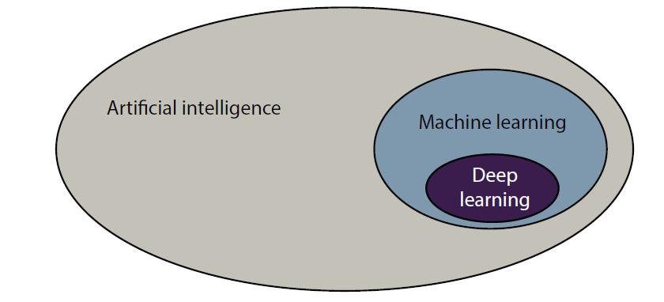

### What is the difference between an **AI-model** and an AI algorithm?

- **AI-algoritme** is een reeks stappen die gebruikt word om een probleem op te lossen/model te bouwen. Zegt hoe het leren gebeurt.

**AI-model** is het resultaat van dat algoritme: Set regels of een wiskunidge voorstelling die is geleerd uit data en die gebruikt wordt om voorspellingen of beslissingen te maken.

### spam filtering
- **Machine learning** algorithms make predictions based on data, models and features.
- Suppose you are asked to design an efficient spam filter using **machine learning**.

- Which features would you take into account and explain why for each feature?

Antwoord: Ik zal kijken naar
- welke mail heeft er naar mij gestuurd
- is er al een gelijkaardige mail gestuurd geweest van een andere zender
- wat staat er in de mail (WIN GELD etc.)
- is het van een groot bedrijf? (grote bedrijven doen meestal niet te moeite om naar u te sturen behalve als je hun "newsletters" wilt ontvangen)
- zijn er bijlage zo ja : hoe groot
- heeft het met geld te maken? bekijk als je wel degelijk aangesloten ben bij die ene "bedrijf"

 
## Hoofdstuk 2 Types of **Machine learning**

### regression models
1. Huisprijsvoorspelling

**Regressiemodellen** voorspellen woningprijzen op basis van kenmerken zoals oppervlakte, locatie en bouwjaar.

Dit wordt gebruikt door makelaars en banken voor waardebepaling.

2. Verkoop- en vraagvoorspelling

Bedrijven gebruiken regressie om toekomstige verkoopcijfers te schatten op basis van hisaltorische data, seizoenen en marketingacties.

3. Weersvoorspelling

**Regressiemodellen** worden toegepast om continue waarden zoals temperatuur of neerslag te voorspellen aan de hand van eerdere metingen.

4. Medische voorspellingen

In de gezondheidszorg wordt regressie gebruikt om bijvoorbeeld bloeddruk, bloedsuiker of hersteltijd van patiënten te voorspellen.

5. Financiële toepassingen

**Regressiemodellen** worden gebruikt voor het voorspellen van aandelenprijzen, rentevoeten en kredietrisico’s.

### regression model/classification model
- **Regressiemodel**: Voorspelt een doorlopende numerieke waarde (een hoeveelheid). De uitvoer is een getal.
- **Classificatiemodel**: Voorspelt een discrete categorie (een label). De uitvoer is een "klasse" of "groep."

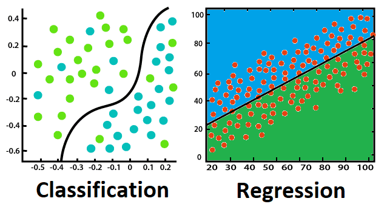
### classification models
1. Spamdetectie

**Classificatiemodellen** bepalen of een e-mail spam of geen spam is op basis van inhoud, afzender en links.

2. Medische diagnose

Classificatie wordt gebruikt om te bepalen of een patiënt wel of geen ziekte heeft, zoals bij kankerdetectie.

3. Kredietgoedkeuring

Banken gebruiken **classificatiemodellen** om te beslissen of een lening wordt goedgekeurd of afgewezen.

4. Beeldherkenning

**Classificatiemodellen** herkennen objecten in afbeeldingen, zoals kat vs. hond of handgeschreven cijfers.

5. Sentimentanalyse

Tekstclassificatie wordt gebruikt om meningen te classificeren als positief, negatief of neutraal, bijvoorbeeld in reviews.
### **clustering** algorithm
Het hoofddoel van **clustering** is om een dataset automatisch op te delen in groepen (clusters). Het algoritme zoekt naar patronen zonder dat je vooraf vertelt waar het op moet letten (unsupervised learning).

Gelijksoortigheid: Punten binnen één groep lijken veel op elkaar.
Onderscheid: Punten in verschillende groepen verschillen sterk van elkaar

- Marketing

- Cybersecurity

- stadsplanning
### **dimensionality reduction**
- Briefly discuss the technique of **dimensionality reduction** in unsupervised learning.
- What is matrix factorisation?
- What is singular value decomposition?
**Dimensie reductie** is een preprocessing stap om de data te versimpelen zonder veel informatie te verliezen. Je kan de dimensies reduceren door features die op elkaar lijken samen te nemen als een grotere feature.

**Matrix factorisatie** is een wiskundige techniek waarbij een grote matrix wordt opgesplitst in het product van twee of meer kleinere, eenvoudigere matrices.

Toepassing: Veelgebruikt in aanbevelingssystemen (zoals Netflix). Het "ontleedt" de interactie tussen gebruikers en films in verborgen factoren (bijv. genre-voorkeuren).

**SVD** wordt gebruikt bij foto decompressie, het gebruikt lineaire algebra technieken om de tabel met data te versimpelen.
###
- What is **Generative **Machine Learning**?
- What is a **GAN**?
- What is a **Restricted Boltzmann Machine**?

1. Wat is Generative **Machine Learning**?
Generative **Machine Learning** is een vorm van **machine learning** waarbij een model leert hoe de data-verdeling eruitziet, zodat het nieuwe, realistische data kan genereren.

In plaats van enkel te classificeren (zoals bij discriminatieve modellen), leert het model hoe data wordt opgebouwd.

Toepassingen: beeldgeneratie, tekstgeneratie, spraaksyntese, data-augmentatie.

2. Wat is een **GAN**?
Een **Generative Adversarial Network** (**GAN**) is een generatief model dat bestaat uit twee neurale netwerken:

Generator → maakt nepdata
Discriminator → probeert echte van nepdata te onderscheiden
Beide netwerken trainen tegen elkaar (adversarial training), waardoor de generator steeds realistischere data leert produceren.

3. Wat is een **Restricted Boltzmann Machine**?
Een **Restricted Boltzmann Machine** (**RBM**) is een stochastisch neuraal netwerk dat bestaat uit:

Een zichtbare laag (input)
Een verborgen laag
Er zijn geen verbindingen binnen dezelfde laag (alleen tussen zichtbaar en verborgen).

**RBM**’s worden gebruikt voor feature learning, **dimensionality reduction** en als bouwstenen van deep belief networks.
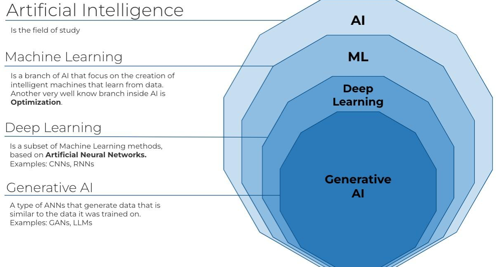
### reinforcement learning

**Reinforcement learning** is een vorm van **machine learning** waarbij een agent leert door interactie met een omgeving. De agent neemt dan acties en krijgt daarvoor beloningen of straffen, en probeert zo zijn belonging te maximaliseren.

- zeflrijdende auto's: Nemen van beslissingen zoals sturen, remmen versnellen op basis van omgeving.
- Trading: Gebruikt om strategieën te leren voor het kopen en verkopen van aandelen.
- Robotica: Leren taken uitvoeren door te oefenen en feedback te krijgen.

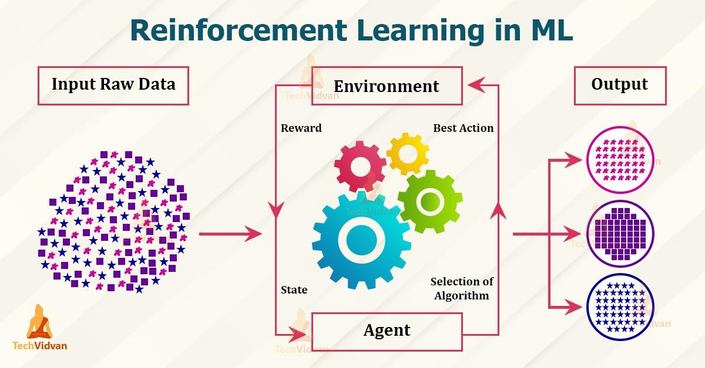

## Hoofdstuk 3 **Lineaire Regressie**
### **Lineaire Regressie**
- What is the principle of **linear regression**?
- Why can **linear regression** be applied in **machine learning**?
- Give some concrete examples of the application of **linear regression** in **machine learning**.
Het doel van **lineaire regressie** is om een lijn te trekken die zo dicht mogelijk bij alle datapunten ligt.

Deze regressie wordt gebruikt voor het voorspellen van waarden, zoals de prijs van een huis.

**Lineaire regressie** wordt binnen ML gebruikt als een supervised learning algoritme voor regressietaken. Het is om de volgende redenen zeer krachtig:

**Voorspellende kracht**: Het kan patronen in historische data identificeren en deze gebruiken om toekomstige waarden te voorspellen.
**Eenvoud en Snelheid**: Het vereist relatief weinig rekenkracht en is zeer snel te trainen, wat ideaal is voor grote datasets.

Enkele voorbeelden zijn huizenprijzen, economie en gezondheidszorg
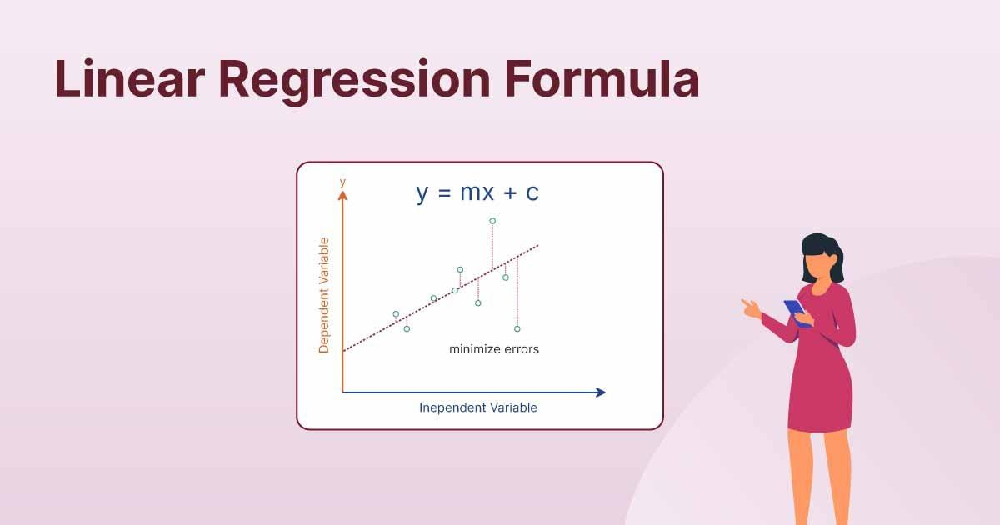
### **bias**
De snelste en meest effectieve manier om de **bias** van een lineair **regressiemodel** te bepalen, is door te kijken naar de Residual Plot.

Door de residuen uit te zetten tegen de voorspelde waarden (of tegen een specifieke onafhankelijke variabele), kun je direct de **bias** zien:

Lage **Bias** (Goed): De punten zijn willekeurig verspreid rondom de horizontale as ($e=0$) zonder herkenbaar patroon. Dit betekent dat het lineaire model de relatie in de data goed begrijpt.

Hoge **Bias** (Slecht): Als je een duidelijke vorm ziet (zoals een kromme of U-vorm), dan heeft het model een hoge **bias**. Dit geeft aan dat de data een niet-lineair verband heeft (bijv. kwadratisch) dat het lineaire model over het hoofd ziet (**underfitting**).
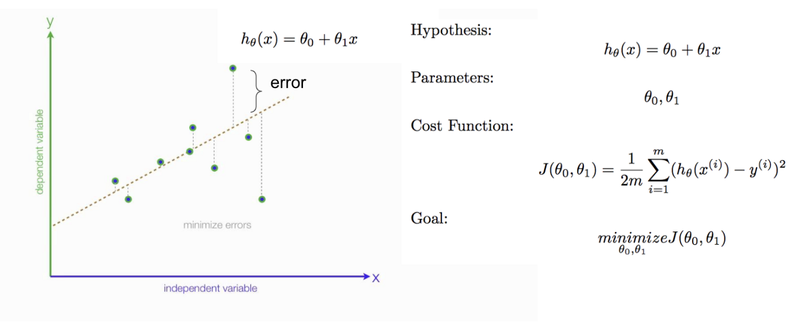
### determining a straight line

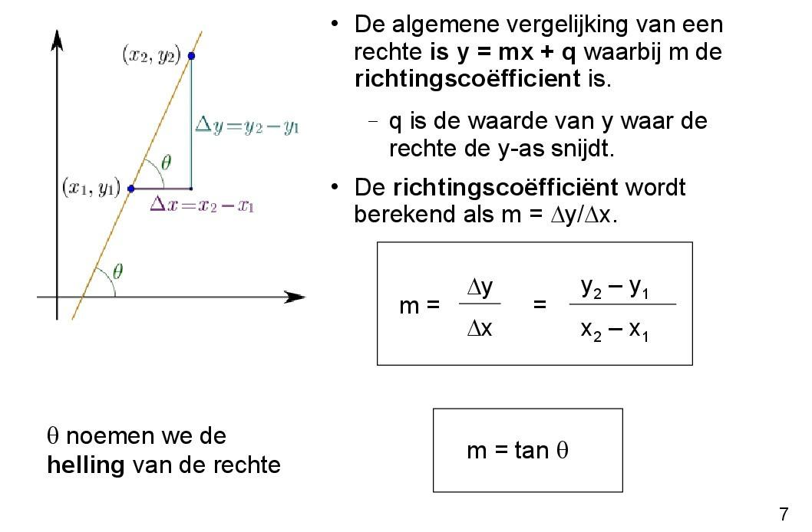
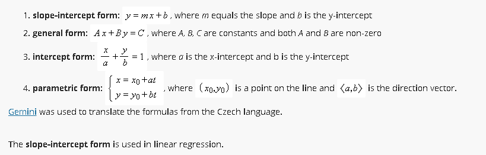
### error functions
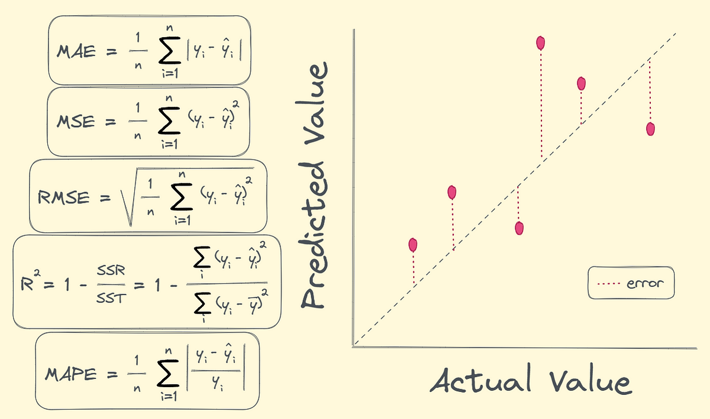
- Explain the principle of MAE (Mean Absolute Error).
- Explain the principle of MSE (Mean Square Error).
- Why is the average error used?
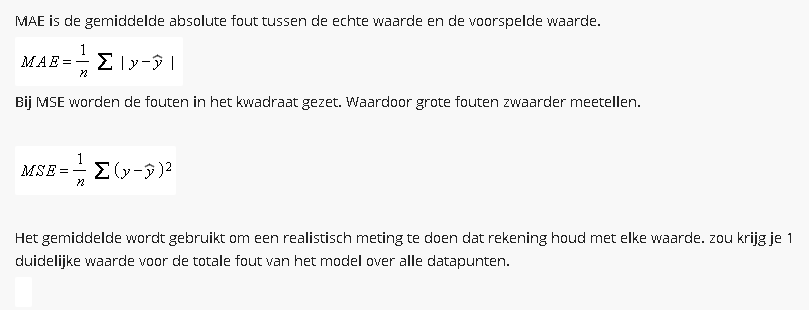

### **Gradient descent**
- What is a gradient and how is it mathematically determined in practice?
- Why is gradient 'descent' used, and what does it mean in practice?
- Why is the technique of **gradient descent** efficient?
- What are the potential pitfalls of applying **gradient descent**?
- stochastic **gradient descent**
- mini-batch **gradient descent**
- batch **gradient descent**

#### antwoord
 **Gradient Descent** is het optimalisatie-algoritme dat de "gewichten" van een model aanpast om de fout (**cost function**) te minimaliseren. Je kunt het vergelijken met het afdalen van een berg in dichte mist: je voelt aan de helling onder je voeten welke kant "omlaag" is.

 De gradiënt is een vector van partiële afgeleiden van de **kostenfunctie** met betrekking tot alle parameters (gewichten) in het model. In de wiskunde geeft de gradiënt de richting aan van de steilste stijging.

 We gebruiken descent (afdaling) omdat ons doel is om de fout te minimaliseren. Omdat de gradiënt de richting van de steilste stijging aanwijst, moeten we precies de tegenovergestelde richting opgaan om de laagste foutwaarde te vinden.

 Snelheid: In plaats van elke mogelijke combinatie van gewichten te proberen (brute force), wijst de wiskunde ons direct de weg naar de verbetering.

 Schaalbaarheid: Het werkt uitstekend met miljoenen parameters, zoals in **deep learning**, omdat de berekening van de afgeleide (via backpropagation) relatief goedkoop is qua rekenkracht.

 Iteratief: Het model leert constant bij terwijl het door de data loopt, waardoor het niet in één keer de perfecte oplossing hoeft te "raden".

 Local Minima: In complexe modellen kan het algoritme vastlopen in een "lokaal dal" dat niet het allerlaagste punt van de hele berg is.

**Learning Rate** problemen:

- Is $\alpha$ te groot, dan schiet je het dal voorbij en explodeert de fout.

- Is $\alpha$ te klein, dan duurt het trainen eeuwig.

- Saddle Points (Zadelpunten): Punten waar de helling nul is, maar die geen dal zijn. Het algoritme "denkt" dan dat het klaar is, terwijl de fout nog hoog is.

- Vanishing/Exploding Gradients: Bij diepe netwerken kunnen de gradiënten onderweg naar de eerste lagen zo klein worden dat het model stopt met leren, of zo groot dat het onstabiel wordt.

Stochastic **Gradient Descent**: Bij **SGD** wordt de gradient berekend op 1 datapunt tegelijk. De parameters worden na elk datapunt geüpdatet. Het is snel en geschikt voor grote datasets, maar er is veel ruis aanwezig.

Mini-batch **gradient descent**: Bij Mini-batch **gradient descent** wordt de gradient berekend op een kleine groep datapoints (batch). Goed balans tussen snelheid en stabiliteit, meest gebriukt in de praktijk.

Batch **Gradient Descent**: Hier wordt de gradient berekend op de volledige dataset. Je gebruikt alle trainingdata om 1 update van de parameters te doen. Zeer nauwkeurig (stabiele richting), maar traag bij grote datasets.

### polynominal regression
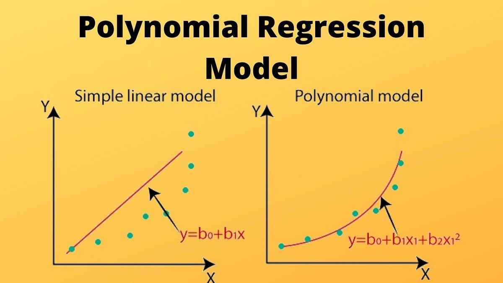

**Polynomiale regressie** is een vorm van regressieanalyse waarbij de relatie tussen de onafhankelijke variabele x en de afhankelijke variabele y wordt gemodelleerd als een n-de graads polynoom. In plaats van een rechte lijn te trekken, zoals bij **lineaire regressie**, gebruikt dit model machten van x (zoals x² of x³) om een kromme lijn door de data te passen. Het principe is dat het model meer flexibiliteit krijgt om complexe, niet-lineaire patronen in de data te vatten.

## Hoofdstuk 4 **underfitting**, **overfitting**, testing en **regularisatie**
### **underfitting**, **overfitting**Underfitting**

    - training error hoog
    - testing error ook hoog
    - Het model leert de trainingsdata niet goed genoeg.
    - Het is te simpel.
**Optimal**

    - training error laag
    - testing error ook laag
    - Het model leert goed en generaliseert ook goed naar nieuwe data.
**Overfitting**

    - training error heel laag
    - testing error duidelijk hoger
    - Het model kent de trainingsdata te goed, maar doet het slechter op nieuwe data
### Training, validatie en testing
De **training set** leert het model patronen, de **validation set** wordt gebruikt om hyperparameters te tunen en **overfitting** te voorkomen, en de **testing set** dient als laatste onafhankelijke check voor de werkelijke prestaties op nieuwe data. Het scheiden van deze sets voorkomt dat het model simpelweg data onthoudt in plaats van algemene regels leert.

Een gangbare verdeling is 70% training, 15% validatie en 15% testen, of 80/10/10 bij grotere datasets. Bij extreem grote datasets kan zelfs 98/1/1 volstaan, zolang de validatie- en testsets maar representatief genoeg zijn voor de gehele populatie.
### complexiteit van het model
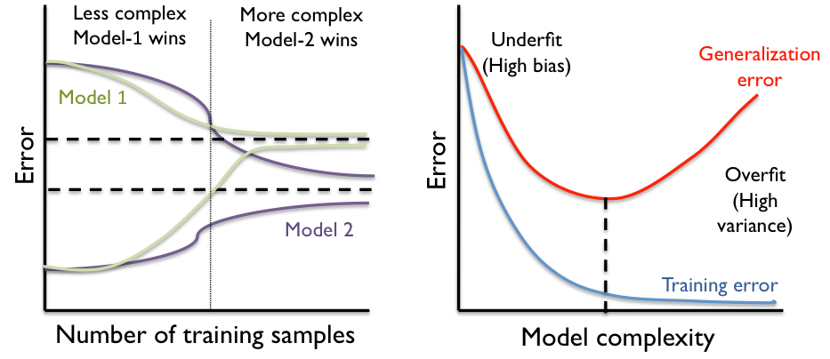

In de grafiek model complexity = f(error) kijk je hoe de MAE verandert als het model eenvoudiger of complexer wordt.

Bij **underfitting** is het model te simpel. Daardoor is de MAE nog hoog, omdat het model de patronen in de data niet goed leert.

Bij het optimale model is de complexiteit precies goed. De MAE is dan het laagst, omdat het model genoeg geleerd heeft zonder te complex te zijn.

Bij **overfitting** wordt het model te complex. Op de trainingsdata lijkt het goed maar op nieuwe data stijgt de fout weer. De MAE op testdata wordt dan groter.

### regulariseren
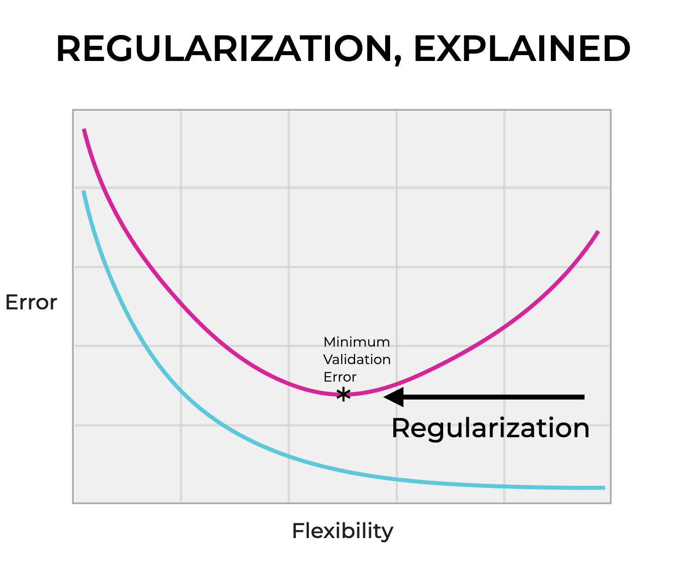

**Regularization** is wanneer je aan de foutfunctie van een model een extra strafterm toevoegt. Die strafterm zorgt ervoor dat het model geen te grote of te complexe gewichten kiest. **Regularization** remt complexiteit af door grote gewichten te bestraffen. Daardoor leert het model meer de algemene patronen en mindere de toevallige details.

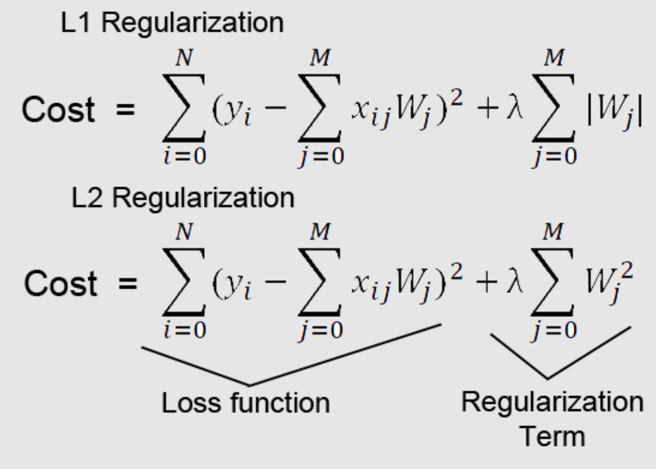
- How does **L1**regularization** work?
- How does **L2**regularization** work?
- How do you determine which **regularization** (**L1** or **L2**) is the best choice for the **machine learning** model?
- Explain the terms '**LASSO** regression' and '**RIDGE** regression'.

**L1**-**regularisatie** voegt de som van de absolute waarden van de gewichten toe aan de **kostenfunctie**. Dit dwingt minder belangrijke gewichten om exact nul te worden, waardoor het model effectief aan feature selectie doet. Het creëert een diamantvormige beperking in de parameterruimte die vaak hoekpunten op de assen raakt.

**L2**-**regularisatie** voegt de som van de kwadraten van de gewichten toe aan de **kostenfunctie**. Dit straft grote gewichten zwaarder af, maar dwingt ze bijna nooit tot exact nul, waardoor alle variabelen een kleine invloed behouden. Het resulteert in een cirkelvormige beperking die de gewichten gelijkmatig verdeelt en het model stabieler maakt.

**L1** is de beste keuze als je vermoedt dat slechts een klein aantal variabelen echt relevant is (sparse data). **L2** geniet de voorkeur wanneer je veel variabelen hebt die allemaal een kleine bijdrage leveren of wanneer variabelen sterk met elkaar gecorreleerd zijn. Vaak wordt via cross-validatie getest welke methode de laagste error op de validatieset oplevert.

**LASSO** (Least Absolute Shrinkage and Selection Operator) is de term voor **lineaire regressie** die gebruikmaakt van **L1**-**regularisatie** om **overfitting** te beperken en variabelen te selecteren. **RIDGE**-regressie is de variant die **L2**-**regularisatie** toepast om de impact van multicollineariteit te verminderen en gewichten klein te houden. Beide methoden gebruiken een tuning-parameter lambda om de sterkte van de straf te bepalen.

## Hoofdstuk 5 
### **step function**
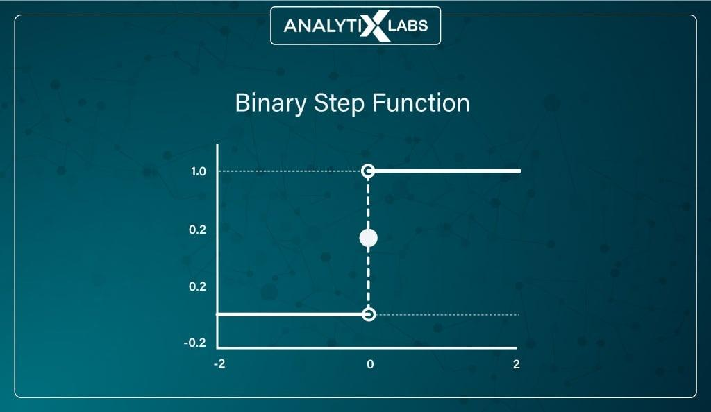

Een **step function** zet een continue input om in een discrete output. Bij binaire classificatie werkt de functie als een **threshold**. Als de inputs of gewogen som ervan boven een bepaalde waarde komen, levert het output 1, anders 0.

Step functions zijn niet differentieerbaar, dus technieken zoals **gradient descent** om de fout te verkleinen zijn niet toepasbaar. Het is ook zéér simplistisch en slecht for complexere relaties. Er is ook geen verschil in gradatie/output tussen juist/volledig **threshold**-overschreidende inputs.

### **bias** & **threshold**
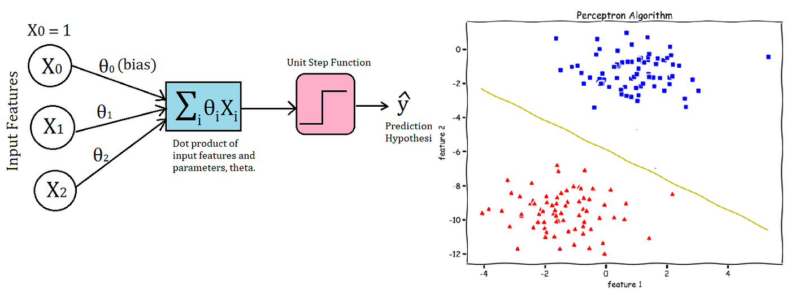

Timo Plets
1 apr. 2026 13:56
NIEUW
Relatie:

In een perceptron zijn **bias** en **threshold** eigelijk 2 manieren om hetzelfde te doen.

De standaardvorm is:

w . x + b

Dit is equivalent aan:

w ⋅ x > **threshold**

De **bias** verschuift dus de beslissingsgrens.

Formeel geldt: **bias** = − **threshold**

Betekenis sign:

Teken van **bias** bepaalt hoe makkelijk het model een bepaald klasse kiest. Positieve **bias** -> makkelijker om ouput = 1 te krijgen, Negatieve **bias** moeilijker om output = 1 te krijgen.

Voorbeeld happy sad:

Stel:

Output = 1 → “happy”
Output = 0 → “sad”
Positieve **bias**:
Zelfs met weinig “positieve woorden” (zoals good, nice) kan de zin al als happy worden geclassificeerd.
Negatieve **bias**:
De zin moet veel positieve signalen hebben om als happy te worden gezien, anders wordt ze sneller als sad geclassificeerd.

### Mean **perceptron error**
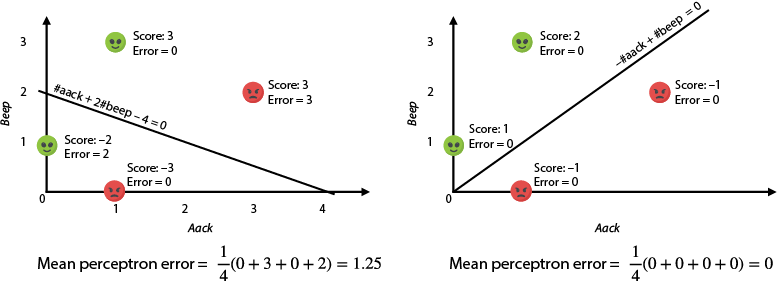

De mean **perceptron error** van een dataset bepaal je door eerst voor elk datapunt de **perceptron error** te berekenen, en daarna daarvan het gemiddelde te nemen.

Voor één punt:

correct geclassificeerd → error = 0
fout geclassificeerd → error = ∣w⋅x+b∣
De fout is de absolute waarde van de score, alleen als het punt fout zit. Punten die correct geclassificeerd zijn, dragen niets bij. :

mean **perceptron error**=som van alle perceptron errors/aantal punten

Je pakt het gemiddelde omdat je dan classifiers of datasets eerlijker kan vergelijken. Bv. als je twee datasets hebt, eentje met 10 zinnen en eentje met 100 zinnen, dan zal de som bijna automatisch groter zijn bij de grotere dataset. Het gemiddelde vermijdt dat probleem.
### **perceptron trick**
De **perceptron trick** is een manier om de belsissingsgrens stap voor stap te verbeten. Als een punt fout gecalssificeerd word -> pas de gewicten en **bias** aan. Dit gebeurt door het punt toe te voegen of af te trekken van de gewichten

Formule (vereenvoudigd):

w = w + η ⋅ y ⋅ x

Het model verschuift de grens zodat het punt de volgende keer correct ligt.

waarom efficiënt?

- Alleen foute punten voor updates
- simple berekeningen (optellen / vermenigvuldigen)
- convergeert snel als de data lineair scheidbaar is
Daardoor is het snel en geschikt voor bc

rol van **learning rate**:

De **learning rate** (η) bepaalt hoe groot de stap is bij elke update:

- Grote η → snelle maar minder stabiele updates
- Kleine η → trager maar nauwkeuriger
Het bepaalt dus hoe snel het model leert en hoe stabiel dat gebeurt.

## Hoofdstuk 6 Logistic classifier
### **sigmoid** Function
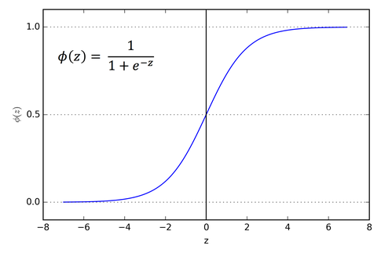
- What is the mathematical form of the **sigmoid** function?
- Show the variation of the **sigmoid** for the values ​​on the x-axis, which can range from -infinity to +infinity.
- What are the advantages of using the **sigmoid** compared to a **step function**?
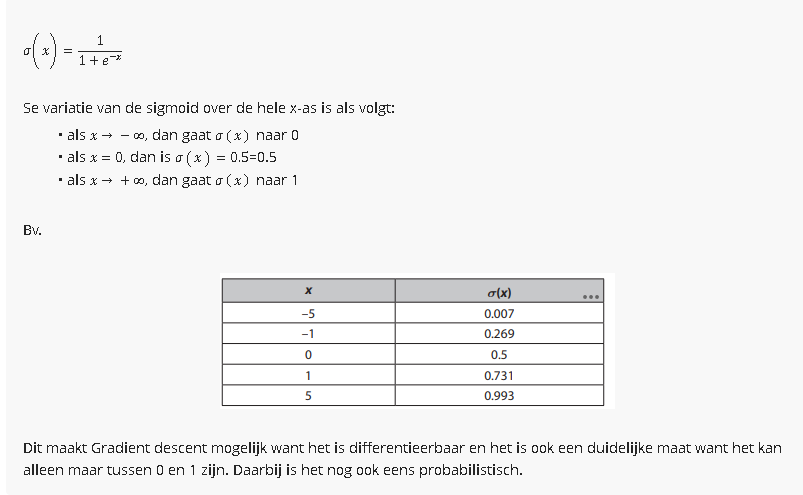
### **log loss error** function
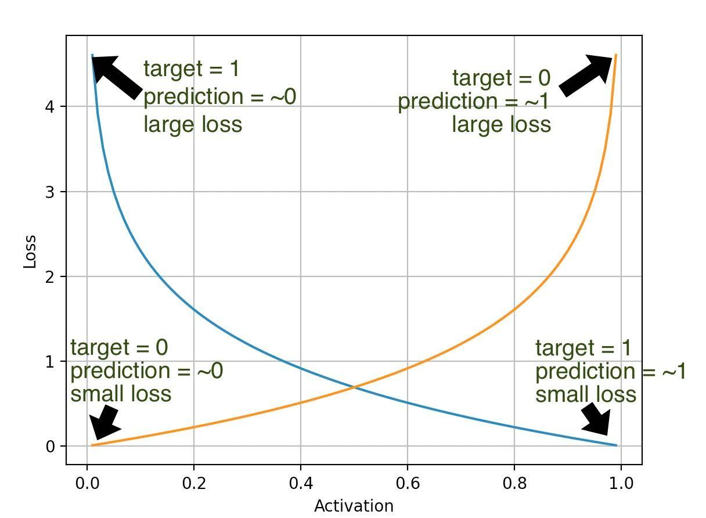
- What is the mathematical form of the **log loss error** function?
- Why is the negative value of the natural logarithm used?
- Why is this error function preferred over the absolute or square error function?
---------------------------------

**log loss**=−yln(y^)−(1−y)ln⁡(1−y^)

Je neem de negatieve waarden van het natuurlijk logaritme omdat de kansen die je vermenigvuldigt liggen allemaal tussen 0 en 1

Als je daarvan het gewone product neemt, krijg je een heel klein getal, zeker bij grote datasets. Dat is moeilijk om mee te werken. De logaritme zet zo’n product om in een som:

ln(a⋅b)=ln(a)+ln⁡(b)

Het logaritme van een getal tussen 0 en 1 is altijd negatief.

Daarom nemen we het minteken ervoor, zodat de fout een positief getal wordt.

Waarom verkiezen we deze errorfunctie boven de absolute of square error?

Ten eerste: de wiskunde werkt mooier.

Er staat expliciet dat de **log loss** populairder is omdat de derivatives veel beter werken met deze functie. Dat is belangrijk tijdens het trainen van logistic classifiers.

Ten tweede: absolute en square error blijven altijd kleiner dan 1 bij classificatie met kansen tussen 0 en 1.

Zelfs als een punt heel slecht geclassificeerd is, blijft die fout dus relatief beperkt. De **log loss** kan daarentegen veel groter worden wanneer het model met veel zekerheid fout zit. Dat straft slechte voorspellingen dus veel sterker af.

### **logistic trick**
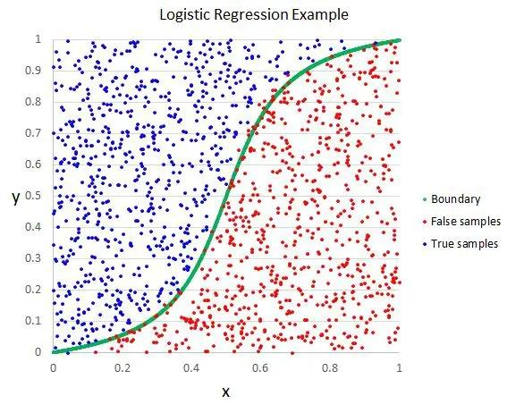
De logistic regression (**logistic trick**) gebruikt de **sigmoidfunctie** om een kans te voorspellen:

p=1/1+e^−(w⋅x+b)

​Daarna wordt de fout berekend met **log loss**, en worden de gewichten aangepast via **gradient descent**:

w=w−η⋅∂loss/∂w

Het model past dus stap voor stap de parameters aan om de fout te verkleinen.

Waarom betere na iedere iteratie.?

Bij elke iteratie:

Wordt de gradient van de foutfunctie berekend
Worden de gewichten aangepast in de richting die de fout verkleint
Daardoor worden de voorspelde kansen steeds beter afgestemd op de echte labels
Omdat **log loss** een convexe functie is, gaat het algoritme systematisch naar een minimum.

Dus:

Foute classificaties krijgen grotere aanpassingen
Correcte classificaties worden versterkt
Hierdoor wordt de classificatie geleidelijk beter na elke stap.
### **softmax** function
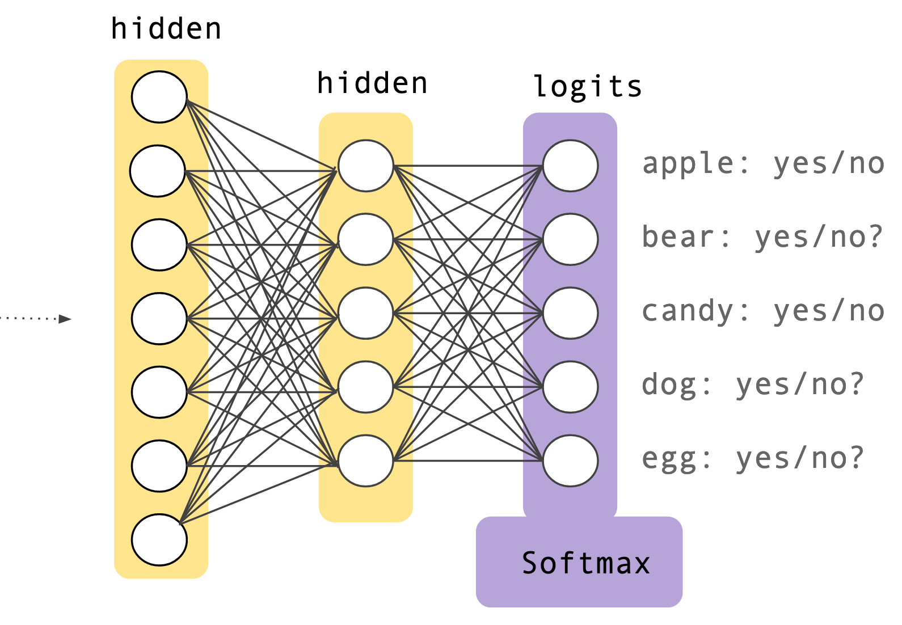

- Describe the mathematical form of the **softmax** function.
- Why is the **softmax** function preferred for multiple classification?
- What is meant by "normalization" when determining probability in multiple classification?

wiskundige formule:

De **softmaxfunctie** zet meerdere waarden om naar kansen:

**softmax**(Zi)=e^Zi /∑j*e^Zj

Elke output ligt tussen 0 en 1, en de som van alle outputs is gelijk aan 1.

Waarom goed voor mutliclass classificatie?

**Softmax** is ideaal voor meerdere klassen omdat:

Het elke klasse een kans geeft
Alle kansen samen optellen tot 1
Het model zo kan kiezen welke klasse het meest waarschijnlijk is
In tegenstelling tot **sigmoid** (voor 1 output), werkt **softmax** voor meerdere outputs tegelijk

Normalization?

Normalisatie betekent dat de outputs worden geschaald zodat ze samen 1 vormen.

Door te delen door de som van alle exponentiële waarden:

∑ **softmax**(Zi)=1

Dit zorgt ervoor dat de outputs echte waarschijnlijkheden zijn.
## Hoofdstuk 7  **Accuracy** of **Machine Learning** Classification Models

### **Accuracy** of **Machine Learning** Classification Models
- What is meant by the '**accuracy**' of a **machine learning** classification model?

**Accuracy** van een **classificatiemodel** betekent:

hoe vaak het model juist is
dus: aantal correcte voorspellingen / totaal aantal voorspellingen

**accuracy**=aantal correct geclassificeerde punten/totaal aantal punten

### Application to determine the '**accuracy**' of a video recommendation model
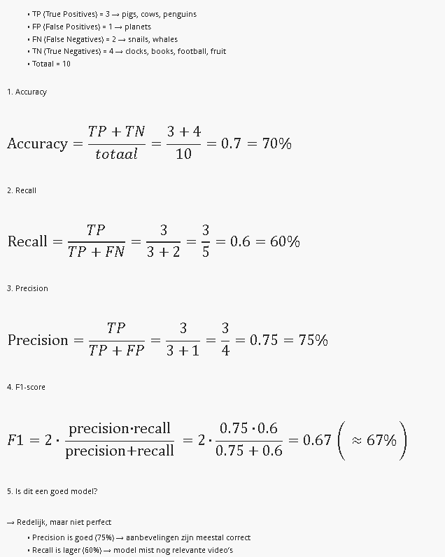
### True/False positives & True/False negatives
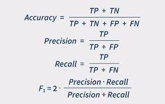
The Selection Matrix

**True Positive** (**TP**): A "Good Hire." The AI recommended them, and they are a high-performing employee.

**False Positive** (**FP**): A "Bad Hire." The AI recommended them, but they underperform or disrupt the team.

**True Negative** (**TN**): A "Correct Rejection." The AI filtered them out, and they truly weren't a fit for the role.

**False Negative** (**FN**): A "Missed Star." The AI rejected them, but they actually had the skills to be an elite employee.
### **confusion matrix**
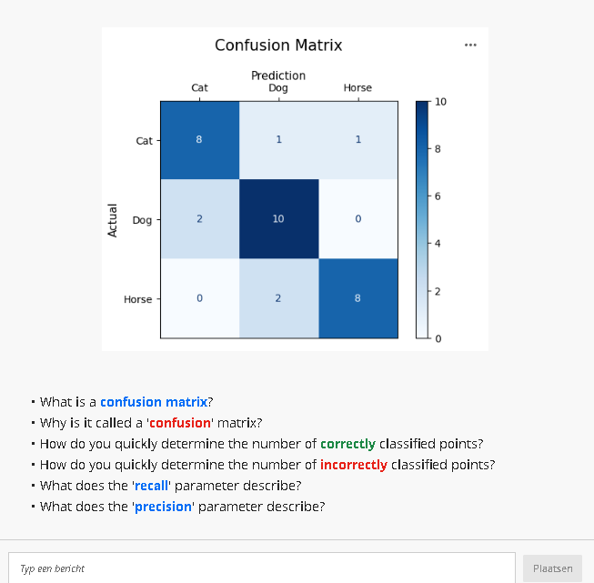

Why is it called 'confusion' matrix?

It is called a "confusion" matrix because it makes it easy to see if the system is confusing two classes (e.g., mistaking a "Cat" for a "Dog"). It highlights exactly where the model is "getting confused" rather than just giving a single **accuracy** percentage.

How to quickly read the matrix

- Correctly classified points: Look at the main diagonal (from top-left to bottom-right). These are the True  Positives (**TP**) and True Negatives (**TN**).

- Incorrectly classified points: Look at the off-diagonal elements. These represent the "leaks" where the model predicted one thing but the reality was another (False Positives and False Negatives).

Understanding the Parameters
**Recall** (**Sensitivity**)
**Recall** answers the question: "Out of all the actual positive cases, how many did we find?"

Focus: It is obsessed with not missing anyone.

Example: In a cancer screening, high **recall** means you caught almost every person who has cancer, even if you accidentally flagged some healthy people as well.

**Precision** (**Reliability**)

**Precision** answers the question: "Out of everyone we predicted as positive, how many were actually correct?"

Focus: It is obsessed with being right when it speaks up.

Example: In a spam filter, high **precision** means that if an email is marked as "Spam," you can be almost 100% sure it isn't an important work email

### **F-score**
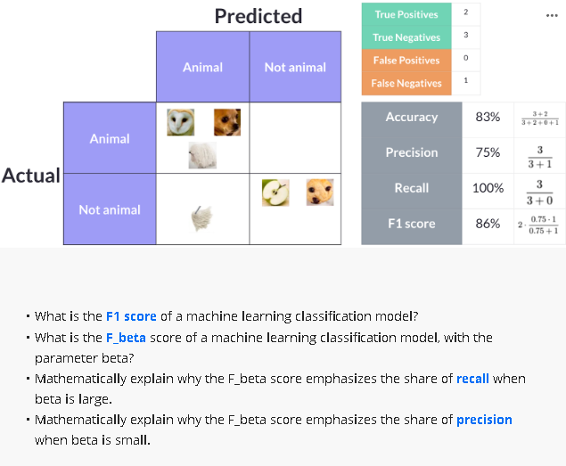

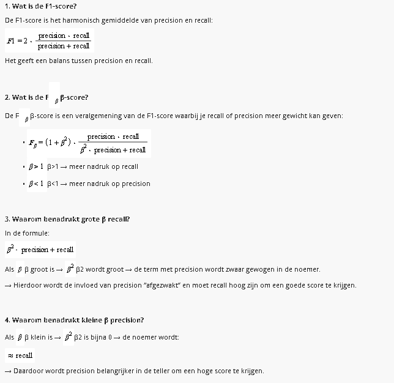

### **ROC** curve

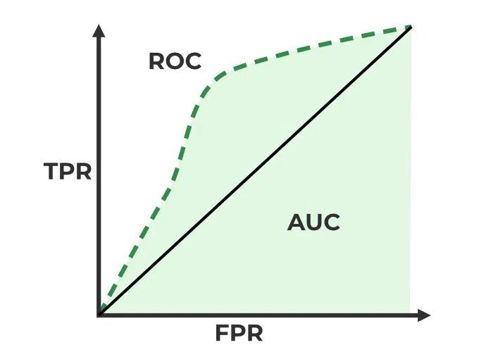

Hoe helpt de **ROC-curve**?

De **ROC-curve** toont de relatie tussen:

- **True Positive** Rate (**recall**)
- **False Positive** Rate
voor verschillende drempelwaarden (thresholds).

→ Zo zie je hoe goed het model spam herkent zonder te veel gewone mails fout te classificeren.

- Een model met een curve dicht bij de linkerbovenhoek is beter
- Een model dicht bij de diagonaal (lijn) is slecht (random)
Hoe helpt **AUC**?

De **AUC** (Area Under the Curve) vat de **ROC-curve** samen in één getal:

- **AUC** ≈ 0.5 → slecht (random gokken)
- **AUC** ≈ 1 → zeer goed model
→ Hoe hoger de **AUC**, hoe beter het model klassen kan onderscheiden.

Hoe kies je het optimale model?
 - Vergelijk meerdere modellen
 - Kies het model met de hoogste **AUC**
 - Kijk ook naar het punt op de **ROC-curve** dat een goede balans geeft tussen:
 - hoge **recall**
 - lage false positives

