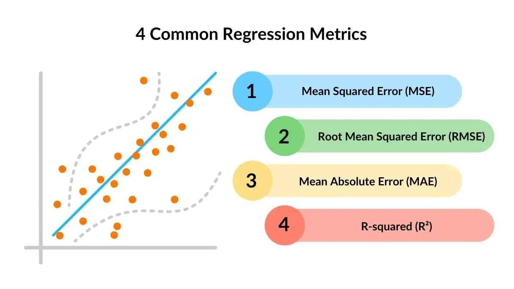

# Examen vragen PPT (Uitgewerkt)

Hieronder staan de specifieke examenvragen uit de PowerPoint netjes beantwoord in het Nederlands. 

### 1. What is Artificial Intelligence (AI)?
**Artificiële Intelligentie (AI)** is de brede tak binnen de computerwetenschappen die zich bezighoudt met het bouwen van systemen die in staat zijn om taken uit te voeren die normaal gesproken menselijke intelligentie vereisen (zoals redeneren, probleemoplossing en patroonherkenning).

### 2. What is the relationship between AI, Machine Learning, and Deep Learning?
- **AI** is het overkoepelende veld van intelligente machines.
- **Machine Learning (ML)** is een subveld van AI waarbij systemen leren uit data om hun prestaties te verbeteren, in plaats van expliciet geprogrammeerd te worden met regels.
- **Deep Learning (DL)** is op zijn beurt een subveld van ML, gebaseerd op diepe kunstmatige neurale netwerken. Het is ontworpen om zeer complexe patronen in grote hoeveelheden ongestructureerde data (zoals beeld of geluid) te herkennen.

### 3. What is the difference between an AI model and an AI algorithm?
- Een **AI-algoritme** is een wiskundige procedure of een reeks stappen (bijv. Lineaire Regressie) die aantoont *hoe* een systeem leert uit data.
- Een **AI-model** is het concrete, getrainde resultaat nadat een algoritme is toegepast op een specifieke dataset. Dit model bevat de geleerde gewichten (parameters) en kan worden gebruikt om voorspellingen te doen over nieuwe data.

### 4. Spam Filter: Which 'features' would you take into account, and explain why?
Bij een ML spamfilter baseren we de voorspelling op datakenmerken (features). Relevante kenmerken zijn:
- **Afzender/Domein**: Komt de mail van een vertrouwd domein of van een onbekend adres?
- **Sleutelwoorden (Keywords)**: Bevat de tekst typische spam-woorden zoals 'WIN', 'GELD', of 'Dringend'?
- **Aanwezigheid/Grootte van bijlagen**: Bevat de mail onverwachte of gevaarlijke bijlagen (zoals .exe of verdachte .zip-bestanden)?
- **URL-links in de tekst**: Bevat de mail veel onbekende of verdachte links (phishing risico)?
- **Hoofdlettergebruik en interpunctie**: Is er sprake van overmatig gebruik van HOOFDLETTERS en uitroeptekens (!!!)?

### 5. Discuss the essential differences between Supervised, Unsupervised, and Reinforcement Learning
- **Supervised Learning**: Het model leert van gelabelde data. Zowel de input als de gewenste correcte output (doelvariabele) zijn vooraf bekend. Doel: classificatie of regressie.
- **Unsupervised Learning**: De data heeft geen labels. Het algoritme gaat zelf op zoek naar verborgen patronen of structuren in de data. Doel: clustering of dimensiereductie.
- **Reinforcement Learning**: Het model (agent) leert door acties uit te voeren in een omgeving. Het krijgt positieve (beloning) of negatieve (straf) feedback en leert via een trial-and-error-methode de optimale strategie om de cumulatieve beloning te maximaliseren.

### 6. What is the difference between a regression model and a classification model?
Beide vallen (meestal) onder Supervised Learning.
- **Regressie**: Voorspelt een continue, numerieke (reële) waarde. Bv. de prijs van een huis (750.000 euro).
  
- **Classificatie**: Voorspelt een discrete categorie of label. Bv. een e-mail is 'Spam' of 'Niet spam'.

### 7. What is the purpose of: clustering, dimensionality reduction, generative algorithm?
- **Clustering**: Het groeperen van ongeclassificeerde data (unsupervised) zodat items binnen één specifieke groep sterk op elkaar lijken, en verschillen van items in andere groepen.
- **Dimensionality reduction**: Het aantal features of dimensies verkleinen terwijl de fundamenteel belangrijke informatie bewaard blijft, om zo de rekenkracht te optimaliseren en ruis te verminderen.
- **Generative algorithm**: Modellen die de onderliggende datadistributie bestuderen en op basis daarvan nieuwe, realistische data kunnen genereren (bv. GANs, of tekst/afbeeldingsgeneratoren).

### 8. Dimensionality reduction in unsupervised learning. Matrix factorization and SVD.
- **Matrix Factorisatie**: Het splitsen van een grote matrix in kleinere factormatrices (wordt vaak gebruikt in Recommendation Engines, bv. voor film- of productsuggesties).
- **Singular Value Decomposition (SVD)**: Een veelgebruikte lineaire-algebramethode om ruis uit een grote dataset te zuiveren en deze te comprimeren.

### 9. Discuss the principle of reinforcement machine learning
Een Agent onderneemt acties in een omgeving (Environment). Dit creëert een nieuwe toestand (State) en levert een terugkoppeling (Reward of Penalty) op. Het model leert via 'trial-and-error' een optimale strategie (policy) aan te nemen om zo de totale beloning over een langere periode te maximaliseren.

### 10. Describe the linear regression algorithm in pseudocode
1. Initialiseer willekeurige gewichten ($) en bias ($).
2. Definieer een learning rate ($\eta$) en het aantal iteraties (epochs).
3. Voor elke iteratie:
   - Bereken de voorspelde waarde: $\hat{y} = w \cdot x + b$
   - Bereken de fout (het verschil tussen voorspeld en actueel:  - \hat{y}$)
   - Update $ en $ via gradient descent en de berekende error.
4. Stop na de geplande iteraties.
5. Het resultaat is de optimale best passende lijn.

### 11. Characteristics of linear regression: Simple trick, Square trick, Absolute trick
- **Simple trick**: Verschuift de regressielijn constant met een kleine willekeurige of vastgestelde stap, ongeacht hoe groot de fout is. Minder accuraat.
- **Square trick**: Gebaseerd op Squared Error (MSE). Je past de parameters lineair proportioneel aan naargelang de grootte van de fout. Grote fouten leiden tot grotere stappen (afgeleide).
- **Absolute trick**: Gebaseerd op Absolute Error (MAE). Neemt stabiele, gelijke stapsnelheden voor een bepaalde parameter, onafhankelijk van hoe ver het punt afwijkt. Hierdoor kunnen extreme uitschieters (outliers) je gradient descent niet onnodig verstoren.

### 12. Why MAE or MSE? Why RMSE in practice?
- **MAE (Mean Absolute Error)**: Robuust en goed bestand tegen extreme uitschieters (outliers).
- **MSE (Mean Squared Error)**: Bestraft extreme afwijkingen veel harder omdat de fout gekwadrateerd wordt. Ideaal wanneer grote fouten onacceptabel zijn.
- **RMSE (Root Mean Square Error)**: Trekt de wortel uit de MSE, waardoor de eenheid van de error weer exact overeenkomt met de afhankelijke variabele (bv. dollars of kilo's). Dit maakt de interpretatie veel logischer.

### 13. Transforming non-linear dataset to polynomial regression (4th degree)
Je voegt simpelweg wiskundige transformaties toe als nieuwe features (zoals ^2, x^3, x^4$). Hierdoor kan het lineaire model achter de schermen via deze nieuwe exponentiële features complexe en buigende curven in de data leren relateren (zoals 'U'-vormen).

### 14 & 15. Determining Underfitting, Optimal fitting, and Overfitting
- **Underfitting**: Training error HOOG, Validatie/Test error HOOG. (Het model is te simpel en leert te weinig).
- **Optimal fitting**: Training error LAAG, Test error LAAG/VERGELIJKBAAR. (Goede balans en sterke generalisatie).
- **Overfitting**: Training error NUL of extreem LAAG, Validatie/Test error schiet de hoogte in. (Het model heeft de trainingsdata 'buiten het hoofd geleerd' incl. de ruis, maar faalt compleet op nieuwe data).

### 16 & 17. L1 norm, L2 norm, Lasso & Ridge Regression
Dit is Regularisatie om complexe wegingen en overfitting af te straffen.
- **L1 / Lasso**: Minimaliseert de som van de absolute waarden van parameters ($\Sigma|w|$). Creëert een 'sparse' model omdat het onbelangrijke parameters of features kan reduceren tot exact 0.
- **L2 / Ridge**: Minimaliseert de som van de kwadraten van parameters ($\Sigma w^2$). Features blijven behouden (bijna nooit exact 0), maar het straft grote parameterwaarden zwaar af. Dit zorgt voor zuivere stabiliteit in het model.

### 18. Why step function as activation? Why used less often?
De stapfunctie in lineaire classificaties is conceptueel makkelijk om in twee ongenuanceerde klassen te splijten (bv. $> 0$ betekent positief). 
Tegenwoordig wordt deze zelden gebruikt in neurale netwerken omdat de wiskundige afgeleide (gradient) overal nul is (behalve op de sprong waar deze ongedefinieerd is). Hierdoor is gradient descent niet mogelijk tijdens backpropagation (het netwerk kan de weights niet updaten).

### 19. Perceptron Algorithm (Perceptron Trick)
Het optimalisatie-algoritme voor een binaire classifier: 
Als een datapunt goed is geclassificeerd, doe dan niks. Is het foutief geclassificeerd (incorrectly classified), update dan de gewichten en bias in de richting óf weg van de datapunten door ze aan te passen in proportie met de learning rate ($\eta$). Zo beweeg je telkens de grenslijn dichter naar de scheiding.

### 20. Error function for perceptron learning (Binary Classification)
Gebruik bij voorkeur **Log-Loss** (Cross-Entropy). Lineaire categorisatie-errors zoals MSE genereren een complexe error-space grafiek vol met meervoudige lokale, platte dalingen (non-calculating minima). De Log-Loss error geeft standaard een perfect bolle (convexe) fouten-curve, waarbij gradient descent snel en eenduidig naar de put met de optimale loss kan dalen.

### 21. Logistic Classifiers & Sigmoid Function
- **Sigmoid curve**: Een soepele S-curve die in het centrum langzaam .5$ doorkruist.
- **Voordelen t.o.v. Step Function**: De outputwaarde wordt getransformeerd van een getal naar een output tussen exact $ en $. Dit geeft wiskundig oneindige differentiatie in gradiënten voor optimalisatie.
- Bovendien is de output direct te koppelen aan en representatief voor de 'kans' (probability). Een output van .88$ betekent dat het algoritme voor \%$ zeker is dat de voorspelling 'Klasse 1' is.

### 22. Log Loss error function
- **Formule**: $	ext{Log Loss} = -[y \cdot \ln(\hat{y}) + (1-y) \cdot \ln(1-\hat{y})]$
- **Waarom LN(-)**: Kansen liggen altijd tussen de $ en de $. Gezien eigenschappen van een logaritme levert dit wiskundig dus altijd voornamelijk een negatief getal op. Het voorbije min-teken transformeert deze naar een uiterst positief getal zodat gradient descent deze ter optimalisatie vlot tot de fout 0 kan minimaliseren.

### 23. Logistic Trick
De beslissingslijn optimaliseert gradueel d.m.v. de waarschijnlijkheidstheorie van de sigmoid curve gemonitord door de Log Loss error. Heeft het model een hevige fout aan een label gekoppeld (Bv classe 1 vereist maar het denkt .10$ output), dan wordt dit onevenredig zwaarder afgestraft via de log loss error tijdens gradient descent, waarna de gewichten fors omrollen richting de beste wiskundige classificatielijn-splitsing.

### 24. Accuracy of an ML Model, and why it is not sufficient?
- **Accuracy (Nauwkeurigheid)**: De totale ratio van voorspelde juiste waarden ten opzichte van alle metingen.
- **Probleem**: Datasets kunnen scheef (imbalanced) zijn. Als slechts \%$ van de geteste patiënten ziek is en het model categoriseert blind iedereen als 'gezond', haal je nog steeds een accuraatheid van \%$. Toch mist dit inferieure model volledig z'n belangrijkste en enige doel: zieken herkennen.

### 25. Confusion matrix
Een  	imes 2$-matrix (tabel) die de modelvoorspellingen (Predicted) vergelijkt met de daadwerkelijke waarheid (Actual). Hieruit vloeien 4 vakken: True Positives (TP), False Positives (FP), True Negatives (TN) en False Negatives (FN). Je kan hiermee in absoluut detail evalueren om in te schatten waaraan of waar het model structureel de mist inslaat.

### 26. Metrics
- **Recall (Sensitiviteit/True Positive Rate)**: $frac{TP} {TP + FN}$. Vang je in werkelijkheid álle voorkomende positieve waarden op? (Belangrijk bij het opsporen van dodelijke kwetsbaarheden en ziektes).
- **Precision (Precisie)**: $frac{TP} {TP + FP}$. Is je positieve oordeel écht betrouwbaar en roep je niet onterecht ('vals alarm/vals positief') gevaar? (Belangrijk bij Spam of fraude waar een False Positive schade toebrengt aan gebruiksgemak).
- **Specificiteit (True Negative Rate)**: $frac{TN} {TN + FP}$. De focus op het effectief bepalen van de ware negatieven in het proces.
- **F-score**: Het harmonische synthesegemiddelde tussen Precision en Recall. Handig om modelprestaties op imbalanced datasets the overzien in 1 centraal getal.
- **ROC en AUC**: De ROC curve test visueel de balans en de trade-off tussen verhoudingen uitgedund: Recall VS (1 - Specificiteit). De verdere **AUC** (Area Under Curve) vertaalt de oppervlakte of totale ruimte onder deze gehele ROC model-lijn curve en bundelt het prestatievermogen robuust terug samen onder één score.
