# Referentievragen – AI Programming

## Inhoudstafel

- [Chapter 1 – Intuition of artificial intelligence](#chapter-1-intuition-of-artificial-intelligence)
- [Chapter 2 – Search Fundamentals](#chapter-2-search-fundamentals)
- [Chapter 3 – Intelligent Search](#chapter-3-intelligent-search)
- [Chapter 4 – Evolutionary algoritms](#chapter-4-evolutionary-algoritms)
- [Chapter 5 – Advanced evolutionary approaches](#chapter-5-advanced-evolutionary-approaches)
- [Chapter 6 – Swarm Intelligence](#chapter-6-swarm-intelligence)
- [Chapter 7 – Swarm Intelligence:Particles](#chapter-7-swarm-intelligenceparticles)

> PDF-tip: Mermaid diagrammen zijn in deze versie omgezet naar SVG-afbeeldingen zodat ze correct mee afdrukken.
> Als je een diagram wil aanpassen: wijzig het bronbestand in assets/mermaid-src en run `py tools/mermaid_to_svg.py`.

# Chapter 1 Intuition of artificial intelligence

- Why is there no unanimous **definition** for artificial intelligence

  **Antwoord**

  Er is geen vaste definitie omdat “AI” afhankelijk is van context en tijd: wat vandaag als AI gezien wordt, wordt morgen vaak “gewone software”. Ook verschillen disciplines (informatica, statistiek, psychologie, filosofie) en doelen (mens-nabootsing vs taakprestatie), waardoor men andere criteria gebruikt.

---

- What is the difference between **quantitative data** and **qualitative data**? Give some concrete examples of both types of data

  **Antwoord**

  - **Kwantitatieve data**: numeriek en meetbaar (bv. leeftijd, temperatuur, aantal clicks, afstand).
  - **Kwalitatieve data**: beschrijvend/categorisch (bv. kleur, type defect, klantfeedbacktekst, sentimentcategorie).

---

- What is difference between **data, information and knowledge**?

  **Antwoord**

  - **Data** = ruwe feiten/metingen zonder betekeniscontext.
  - **Informatie** = data met context/interpretatie (bv. gemiddelde per dag).
  - **Kennis** = toepasbare inzichten/regels om beslissingen te nemen (bv. “bij <0°C strooien”).

  

---

- What is an **algorithm**? What is an **AI algorithm**? What are the **components** of an algorithm?

  **Antwoord**

  - **Algoritme**: een eindige reeks stappen die input omzet naar output.
  - **AI-algoritme**: algoritme gebruikt voor “intelligent” gedrag (leren, redeneren, zoeken, optimaliseren, omgaan met onzekerheid).

  **Componenten**

  - **Input** (gegevens)
  - **Representatie** (hoe je de data/toestand voorstelt)
  - **Stappen/regels** (control flow)
  - **Parameters** (instellingen)
  - **Evaluatie/doelfunctie** (kost/fitness)
  - **Output** (resultaat)

---

- Give a few **categories of problems** that people are trying to solve via (AI) algorithms.

  **Antwoord**

  - Classificatie (spam/geen spam)
  - Regressie/voorspelling (huisprijs)
  - Clustering (klantsegmenten)
  - Optimalisatie (roostering)
  - Planning en routefinding
  - NLP (vertaling/samenvatten)
  - Computer vision (objectdetectie)
  - Anomaly detection
  - Aanbevelingssystemen

---

- What is the difference between a **local best solution** and a **global best solution**?

  **Antwoord**

  - **Lokale beste oplossing**: beste oplossing binnen een beperkte “buurt” van oplossingen.
  - **Globale beste oplossing**: beste oplossing over alle mogelijke oplossingen.

  

---

- What is the difference between **super intelligence, general intelligence and narrow intelligence**

  **Antwoord**

  - **Smalle (narrow) intelligentie**: gespecialiseerd in één taak (bv. schaakengine, spamfilter).
  - **Algemene (general) intelligentie**: brede, mensachtige intelligentie over veel taken (hypothetisch).
  - **Superintelligentie**: overstijgt menselijke prestaties in (bijna) alle domeinen (speculatief).

---

- What is the relationship between **biology-inspired algorithms, machine learning, deep learning and search algorithms**?

  **Antwoord**

  - **Machine learning** is een deel van AI.
  - **Deep learning** is een deelverzameling van machine learning.
  - **Search-algoritmen** (bv. BFS/DFS/A*) lossen zoek- en padproblemen op.
  - **Biology-inspired algoritmen** (bv. GA/ACO/PSO) zijn metaheuristieken voor optimalisatie/zoeken en kunnen ook gebruikt worden om ML-modellen te tunen.

  

---

- Which three types of **'learning'** fall under **machine learning** and concisely explain each type of 'learning'?

  **Antwoord**

  - **Supervised learning**: leren met gelabelde voorbeelden (input → label).
  - **Unsupervised learning**: patronen/structuur vinden zonder labels (bv. clustering).
  - **Reinforcement learning**: leren via beloning/straffen door interactie (policy leren).

  

# Chapter 2 Search Fundamentals

- What is a **data structure** and give some concrete examples of data structures?

  **Antwoord**

  Een datastructuur is een manier om data te organiseren zodat bewerkingen (zoeken, toevoegen, verwijderen) efficiënt kunnen gebeuren.

  **Voorbeelden**

  - array/lijst
  - stack
  - queue
  - hash map/dictionary
  - linked list
  - tree
  - graph

---

- Explain the following terms: **graph, vertex, node and edge**.

  **Antwoord**

  - **Graph**: verzameling knopen + verbindingen.
  - **Vertex/node**: punt/entiteit.
  - **Edge**: verbinding/relatie (gericht/ongericht, gewogen/ongewogen).

---

- Given: a **graph**
    - Assignment: determine the 'array of edges', the 'incidence matrix' and the 'adjacency matrix'

      **Antwoord (hoe aanpakken)**

      1) **Array of edges**: noteer elke verbinding als (u,v) of (u,v,w) bij gewichten.
      2) **Incidence matrix** (nodes × edges): elke kolom = 1 edge; zet 1 bij de twee incident nodes (bij gerichte graf vaak -1 voor start en +1 voor eind).
      3) **Adjacency matrix** (nodes × nodes): A[i,j] = 1 (of gewicht) als er een edge is van i naar j; anders 0.

        **Visualisatie (voorbeeld)**

        Voorbeeld van een *ongerichte* graaf met knopen A,B,C,D en edges e1..e4.

        

        **Array of edges (met labels)**

        - e1 = (A,B)
        - e2 = (A,C)
        - e3 = (B,D)
        - e4 = (C,D)

        **Adjacency matrix** (rij = van, kolom = naar; bij ongericht is dit symmetrisch)

        |   | A | B | C | D |
        |---|---|---|---|---|
        | A | 0 | 1 | 1 | 0 |
        | B | 1 | 0 | 0 | 1 |
        | C | 1 | 0 | 0 | 1 |
        | D | 0 | 1 | 1 | 0 |

        **Incidence matrix** (rij = node, kolom = edge; bij ongericht: 1 als node incident is)

        |   | e1 (A,B) | e2 (A,C) | e3 (B,D) | e4 (C,D) |
        |---|----------|----------|----------|----------|
        | A | 1        | 1        | 0        | 0        |
        | B | 1        | 0        | 1        | 0        |
        | C | 0        | 1        | 0        | 1        |
        | D | 0        | 0        | 1        | 1        |

        *Opmerking (gericht):* vaak zet je -1 bij de startnode en +1 bij de eindnode per edge-kolom.

---

- Explain a tree is connected acylic graph

  **Antwoord**

  Een boom is een samenhangende (connected) graaf zonder cycli (acyclic). Equivalent:

  Met n knopen heeft een boom exact n - 1 edges.

  en bestaat er precies één uniek pad tussen twee knopen.

---

- explain the following tree terms: root node , parent node , sibling node , descendent, ancestor, leaf node , goal node, path cost, degree and depth.

  **Antwoord**

  - Root = bovenste knoop.
  - Parent = directe voorganger.
  - Sibling = knopen met dezelfde parent.
  - Descendent = knoop in de subtree onder een knoop.
  - Ancestor = knopen op het pad richting root.
  - Leaf = knoop zonder kinderen.
  - Goal node = doeltoestand.
  - Path cost = som van kosten langs pad.
  - Degree = aantal kinderen.
  - Depth = afstand (aantal edges) vanaf root.

  **Voorbeeld (Mermaid)**

  

---

- Explain the Breadth-First Search (BFS) algorithm and which data structure is used?

  **Antwoord**

  BFS verkent de zoekruimte niveau per niveau (alle knopen op diepte 0, dan 1, dan 2, …). Het gebruikt een **queue (FIFO)**. In ongewogen grafen geeft BFS de kortste route in aantal stappen.

---

- Given: a search tree
    - Assignment: apply the Breadth-First Search (BFS) algorithm to find any solution

      **Antwoord (hoe aanpakken)**

      Start bij de root, zet in queue, haal telkens vooraan uit de queue, voeg kinderen achteraan toe (van links naar rechts zoals gegeven) tot je een goal node tegenkomt.

      **Voorbeeld zoekboom (Mermaid)**

      

      BFS-volgorde (level-order) in dit voorbeeld: A, B, C, D, E, F, GOAL.

---

- Explain the Depth-First Search (DFS) algorithm and which data structure is used?

  **Antwoord**

  DFS gaat telkens zo diep mogelijk langs één tak en backtrackt wanneer een knoop geen (onbezochte) kinderen meer heeft. Het gebruikt een **stack (LIFO)** of recursie.

---

- Given: a search tree
    - Assignment: apply the Depth-First Search (DFS) algorithm to find any solution

      **Antwoord (hoe aanpakken)**

      Start bij de root, volg steeds het (bv. meest linkse) kind tot je niet verder kan, dan backtrack. Stop zodra je een goal node bereikt.

      **Voorbeeld DFS-volgorde (Mermaid)**

      

      DFS-volgorde (depth-first) in dit voorbeeld: A, B, D, E, C, F, GOAL.

# Chapter 3 Intelligent Search

- Heuristics
    - What is a heuristic?

      **Antwoord**

      Een heuristiek h(n) is een schatting van de resterende kost/afstand van node n naar het doel.

    - Why can heuristics improve the efficiency of search problems?

      **Antwoord**

      Ze sturen de zoekrichting naar meer beloftevolle paden, waardoor minder knopen hoeven te worden uitgebreid (sneller/goedkoper zoeken).

    - Give a few concrete examples of heuristics.

      **Antwoord**

      - Manhattan distance (grid)
      - Euclidische afstand
      - straight-line distance (kaart)
      - “aantal misplaatste tegels” (8-puzzel)
      - 1/d als nabijheidsheuristiek

---

- A* Search
    - Explain how the A* search algorithm works.

      **Antwoord**

      A* kiest telkens de node met laagste evaluatiefunctie:

      f(n) = g(n) + h(n)

      waarbij g(n) de kost tot nu is en h(n) de geschatte resterende kost. Het beheert typisch een prioriteitsqueue (open set) en breidt telkens de beste kandidaat uit.

    - How is the cost function determined?

      **Antwoord**

      Je definieert edge-kosten volgens het probleem (afstand, tijd, geld, risico). Dan is g(n) de som van edge-kosten; h(n) moet in dezelfde eenheid een schatting geven naar het doel.

    - given: a search tree with the cost per node.
    - question: determine the sequence of searching the search tree, using the A* algorithm.

      **Antwoord (hoe aanpakken)**

      Bereken per kandidaatnode f = g + h, kies steeds de laagste f, breid uit, update g-waarden voor kinderen, herhaal tot goal. Bij gelijke f: gebruik de tie-break regel die je docent hanteert (bv. laagste h of laagste g of links-naar-rechts).

---

- Min-Max Adversarial Search
    - Explain how the min-max adversarial search algorithm works.

      **Antwoord**

      In een spelboom wisselen MAX (jij) en MIN (tegenstander). MAX kiest de maximale waarde uit de kinderen; MIN kiest de minimale. Waarden worden van de bladeren terug naar boven gepropageerd.

      **Voorbeeld (Mermaid)**

      

    - given: a search tree with the cost for each leaf node.
    - question: determine the value of each node in the min-max search tree.

      **Antwoord (hoe aanpakken)**

      Vul bladwaarden in, ga één niveau omhoog: op MAX-niveau neem max, op MIN-niveau neem min; herhaal tot de root.

---

- Alpha-Beta Pruning
    - Explain how the alpha-beta pruning adversarial search algorithm works.

      **Antwoord**

      Alpha-beta pruning is minimax met grenzen: tijdens het doorzoeken houdt MAX een ondergrens (α) en MIN een bovengrens (β) bij. Als een tak niet meer kan leiden tot een betere keuze (α ≥ β), wordt die tak niet verder onderzocht.

      **Voorbeeld (Mermaid, met pruned tak)**

      

    - What is alpha? What is beta?

      **Antwoord**

      α = beste (hoogste) waarde die MAX al zeker kan halen op het huidige pad.

      β = beste (laagste) waarde die MIN al zeker kan afdwingen op het huidige pad.

    - What makes alpha-beta pruning a much more efficient search algorithm?

      **Antwoord**

      Het vermijdt het evalueren van takken die de eindbeslissing toch niet meer kunnen beïnvloeden, waardoor minder knopen bezocht worden (sneller) zonder het resultaat van minimax te veranderen.

    - given: a search tree with the cost for each leaf node.
    - question: determine the value of each node in the     search tree and explain why certain branches
    in the search tree may be pruned.

      **Antwoord (hoe aanpakken)**

      Doorzoek links-naar-rechts (zoals gegeven), update α en β bij elke node. Zodra α ≥ β bij een node, prune je de resterende kinderen van die node (ze kunnen de keuze niet verbeteren).

      (Netter genoteerd: update α en β; prune zodra α ≥ β.)

# Chapter 4 Evolutionary algoritms

- Genetic Algorithm: Life cycle
    - Briefly explain the life cycle of a genetic algorithm.

      **Antwoord**

      Initialiseer populatie → evalueer fitness → selecteer ouders → crossover → mutatie → vorm nieuwe generatie (vaak met elitisme) → herhaal tot stopcriterium.

---

- Enter diversity
    - Genetic algorithms use crossover and mutation as principles to ensure the diversity of the next
generations.
        - Explain this principle.

          **Antwoord**

          Crossover combineert eigenschappen van twee ouders; mutatie introduceert kleine willekeurige veranderingen. Samen voorkomen ze dat de populatie te snel “gelijk” wordt en vastloopt in lokale optima.

        - Give some examples of crossover and mutation.

          **Antwoord**

          - Crossover: one-point, two-point, uniform crossover.
          - Mutatie: bit-flip (binair), swap mutation (permutaties), Gaussian perturbation (reëel).

---

- Genetic Algorithm parameters
    - Name 5 parameters to configure a genetic algorithm.

      **Antwoord**

      - Populatiegrootte
      - Crossover rate
      - Mutatie rate
      - Selectiemechanisme/selectiedruk (bv. tournament size)
      - Elitisme-percentage (of aantal elites)

    - How does each parameter affect the generation of solutions?

      **Antwoord**

      - Grotere populatie = meer exploratie maar duurder.
      - Hogere crossover = meer recombinatie.
      - Hogere mutatie = meer diversiteit maar ook meer ruis.
      - Hogere selectiedruk = sneller convergeren maar minder diversiteit.
      - Meer elitisme = kwaliteit behouden maar risico op premature convergentie.

---

- Fitness function
    - What is a fitness function within genetic algorithms?

      **Antwoord**

      Een functie die elke kandidaatoplossing een score geeft die aangeeft hoe goed ze is t.o.v. het doel.

    - Why is the correct choice of the right fitness function crucial for the performance of the algorithm? 

      **Antwoord**

      De GA optimaliseert precies wat je meet. Een slechte fitness leidt tot het optimaliseren van het verkeerde doel, misleidende tussenoplossingen en slechtere/ongewenste eindresultaten.

# Chapter 5 Advanced evolutionary approaches

- Selection mechanisms
    - Briefly discuss the principle of following selection mechanisms in the evolutionary algorithm and discuss the advantages and disadvantages of each selection mechanism
        - roulette-wheel selection

          **Antwoord**

          Kans om gekozen te worden is proportioneel aan fitness. **+** simpel **-** gevoelig voor fitness-schaal en uitbijters.

        - rank selection

          **Antwoord**

          Individuen worden gerangschikt en selectie hangt af van rang (niet absolute fitness). **+** stabieler **-** kan trager convergeren.

        - tournament selection

          **Antwoord**

          Kies willekeurig k kandidaten en neem de beste. **+** makkelijk te tunen met k **-** bij groot k: minder diversiteit.

        - elitism selection

          **Antwoord**

          Beste individuen gaan gegarandeerd door naar volgende generatie. **+** behoud kwaliteit **-** te veel elitisme kan vroegtijdige convergentie veroorzaken.

---

- Mutation mechanism
    - Briefly discuss the principle of following mutation mechanisms in the evolutionary algorithm
        - boundary mutation

          **Antwoord**

          Zet een gen naar de onder- of bovengrens van het toegelaten interval. Handig om grenzen te verkennen.

        - arithmetic mutation

          **Antwoord**

          Past waarden rekenkundig aan (bv. x' = x + δ of een gewogen combinatie). Geschikt voor reële getallen.

---

- Tree encoding and tree crossover
    - Briefly discuss the principle of:
        - tree encoding

          **Antwoord**

          Representatie van oplossingen als bomen (bv. expressies/programma’s in genetic programming).

        - tree crossover

          **Antwoord**

          Wissel subtrees tussen twee ouderbomen (subtree swap) om nieuwe nakomelingen te maken.

# Chapter 6 Swarm Intelligence

- Swarm intelligence
    - Explain what swarm intelligence is and on what principles is this form of intelligence based.

      **Antwoord**

      Swarm intelligence is collectieve “intelligentie” die ontstaat uit veel simpele agenten met lokale regels. Principes: zelforganisatie, lokale interacties, positieve feedback (versterking), negatieve feedback (verdamping), en stigmergie (communicatie via de omgeving).

    - Why is the analogy to ants selected in the ant optimization algorithm?

      **Antwoord**

      Mieren vinden korte paden door feromonen: goede paden krijgen meer feromoon en worden vaker gekozen. ACO modelleert dat probabilistisch en iteratief.

---

- Ant colony optimization algorithm
    - Discuss the different steps in the ant colony optimization algorithm

      **Antwoord**

      Initialiseer feromonen → elke mier construeert route (kansgestuurd) → evalueer routes → feromoon verdamping → feromoon deposit (meer op betere routes) → herhaal.

    - Discuss the mathematical formula for destination selection based on pheromones and distance heuristics.

      **Antwoord**

      Typisch:

      P(i→j) = (τ_ij^α · η_ij^β) / Σ_{k∈N(i)} (τ_ik^α · η_ik^β)

      met τ = feromoon, η = heuristiek (vaak η_ij = 1/d_ij), en α en β bepalen het belang van feromoon vs afstand.

    - How is the best solution ultimately determined?

      **Antwoord**

      Door over iteraties de beste (laagste kost) gevonden route bij te houden (global best) of via feromoonconvergentie naar de beste route.

    - What criteria can be used to stop the algorithm?

      **Antwoord**

      Max iteraties/tijd, oplossing onder drempel, geen verbetering gedurende N iteraties, convergentie van feromonen.

---

- Ant colony optimization algorithm –selection of the destination
    - given: a figure showing the distances between different objects and the intensity of the pheromones on each of the paths.
    - question: discuss how the destination with the highest probability is determined. Use the mathematical formula for selecting the destination and choose your own value for alpha and beta.

      **Antwoord (hoe aanpakken)**

      Kies α en β (bv. α = 1, β = 2). Bereken per mogelijke volgende bestemming j:

      τ_ij^α · (1/d_ij)^β

      Deel elk resultaat door de som van alle resultaten om kansen te krijgen. De hoogste kans = meest waarschijnlijke bestemming.

      Netter uitgeschreven (met dezelfde keuze α = 1, β = 2):

      score(j) = τ_ij^α · (1/d_ij)^β

      P(i→j) = score(j) / Σ_{k∈N(i)} score(k)

# Chapter 7 Swarm Intelligence:Particles

- Particle swarm intelligence: bird flocks
    - What do the following terms mean for simulating the movement of individual birds in relation to bird flocks?
        - Alignment

          **Antwoord**

          Beweeg in de richting van de gemiddelde vliegrichting van nabije buren.

        - Cohesion

          **Antwoord**

          Beweeg naar het gemiddelde centrum (positie) van de buren om de groep samen te houden.

        - Separation

          **Antwoord**

          Houd afstand en wijk uit om botsingen te vermijden (repulsie op korte afstand).

---

- Particle swarm optimization algorithm
    - Discuss the different steps in the particle swarm optimization life cycle algorithm

      **Antwoord**

      Initialiseer posities/snelheden → evalueer fitness → update persoonlijke beste (pbest) en globale beste (gbest) → update snelheid → update positie → herhaal.

    - Discuss how the position of the particles is updated

      **Antwoord**

      Eerst update je de snelheid op basis van inertia + cognitive + social; daarna update je de positie met:

      x(t+1) = x(t) + v(t+1)

    - How is the best solution ultimately determined?

      **Antwoord**

      De beste oplossing is de globale beste positie (gbest) met hoogste fitness (of laagste kost) gevonden door de swarm.

    - What criteria can be used to stop the algorithm?

      **Antwoord**

      Max iteraties/tijd, doelkwaliteit bereikt, geen verbetering gedurende N iteraties, snelheids/positie-convergentie.

---

- Particle swarm optimization algorithm
    - Explain the following relation:
        - new velocity = inertia component + cognitive component + social component

          **Antwoord**

          De nieuwe snelheid combineert (1) momentum van vorige snelheid, (2) aantrekking naar eigen beste ervaring (pbest), en (3) aantrekking naar beste van de groep (gbest).

    - What is the function of?
        - The inertia component

          **Antwoord**

          Zorgt voor “momentum” en balans tussen exploratie en stabiliteit (niet meteen stilvallen).

        - The cognitive component

          **Antwoord**

          Laat een particle terugkeren naar zijn eigen beste positie (zelf-ervaring), bevordert individuele exploratie.

        - The social component

          **Antwoord**

          Trekt particles richting de beste globale oplossing (gbest), bevordert collectieve convergentie.

