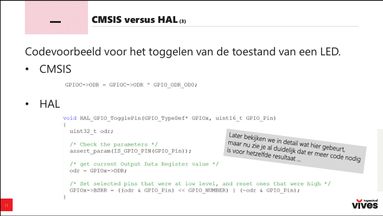

# Les 1

**Wat is HAL**

    Hal is een afkorten voor Hardware Abstaction Layer.

**Doelstellingen**

    IO-transfer inoefenen

    polling 
    interrupts
    Direct Memory Acces (DMA)

**Software**

    Keil voor software 

    STM programma voor pinnen aanduiding

**voordelen van HAL**

HAL heeft als voordeel dat men gemakkelijker naar een andere microcontroller kunnen gaan

**Verschil van tussen CMSIS en HAL**

    CMSIS: (van boven naar beneden)

    - Jouw eigen code
    - CMSIS-bibliotheken
    - Microcontroller hardware

    HAL: (van boven naar beneden)

    - Jouw eigen code
    - HAL-bibliotheken
    - LL-Bibliotheken
    - CMSIS-bibliotheken
    - Microcontroller hardware

