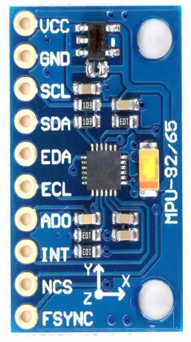

Download het codevoorbeeld I2C - DMA - MPU9250 en servo - headtracker en los onderstaande vragen daarmee op.

Voor een aantal vragen zal je ook de datasheets van de MPU-9250 sensor moeten raadplegen (zie Toledo onder Documentatie > Datasheets externe modules).

Let op: de invulvragen zijn hoofdlettergevoelig!

1. Lees de weerstandswaarde af van de pull-upweerstanden die gebruikt worden op ons MPU-9250 breakout bord (als je nog niet beschikt over dit bordje, kan je hiervan een foto terugvinden op Toledo). 

Antwoord:

4.7 kΩ

2.  Is de functie HAL_I2C_Master_Receive() een blokkerende functie?

A. Ja
B. Nee
Antwoord:

A

3. Waarom wordt er her en der in de code vermenigvuldigd met 256? Net zoals hieronder aangegeven:

sensordata.gyroY = (int16_t)(i2cData[10] * 256 + i2cData[11]);

Antwoord:

Omdat de sensor 16-bit waardes in twee 8-bit registers levert: de eerste is de high byte en de tweede de low byte. Vermenigvuldigen met 256 (2^8) schuift de high byte 8 bits naar links; optellen met de low byte vormt zo de volledige 16-bit signed waarde.

4. In de codevoorbeelden uit de les wordt de I²C-bus via DMA uitgelezen via de DMA-controller 1, dan moet je channel 7 gebruiken voor die communicatie.

Maar veronderstel nu dat je DMA-controller 2 wil gebruiken, welk kanaal moet je dan gebruiken?

Antwoord:

Je kiest een DMA2-channel en koppelt daar de I2C1_RX request (DMAMUX) aan — er is dus niet één vaste "moet" channelnummer. Concreet: stel in je DMA-configuratie de Request in op `DMA_REQUEST_I2C1_RX` (DMAMUX request voor I2C1_RX, in de HAL-headers vaak waarde 17). Met DMAMUX op de STM32L4 kun je een van de DMA2_Channel1..DMA2_Channel7 gebruiken en die naar `DMA_REQUEST_I2C1_RX` (I2C1 RX) routen. CubeMX kiest automatisch een geschikt DMA2_Channel als je de controller op DMA2 zet.

Kort antwoord (samengevat): Gebruik een DMA2_Channel (bijv. DMA2_Channel1..7) en zet `hdma.Init.Request = DMA_REQUEST_I2C1_RX` (DMAMUX request voor I2C1_RX). Er is geen universeel single channel‑nummer dat altijd geldt.

5. De drie gyroscopen van de MPU-9250 kunnen ingesteld worden op verschillende schalen. Wat is de maximumschaal waarop je kan werken? Hoeveel graden per seconde (°/s) kan de sensor dus maximum opmeten?

Antwoord:

Maximum full-scale: ±2000 °/s (de sensor ondersteunt ±250, ±500, ±1000 en ±2000 °/s; de grootste is dus ±2000 °/s).

6. Welke waarde zal je op een oscilloscoop of logic analyzer zien als eerste byte die via I²C wordt verstuurd bij het opstarten van communicatie met de MPU-9250, wanneer je een leesactie wilt uitvoeren? Geef de waarde in hexadecimale vorm. We gebruiken het standaard slave-adres van de MPU-9250.

Antwoord:

0xD1  (bij standaard AD0 = 0 → 7-bit adres 0x68; read = (0x68 << 1) | 1 = 0xD1)

7. Duid de juiste bewering aan. 

A. De MPU-9250 heeft intern analoge gyroscopen en accelerometers. Die analoge waarden kan je opvragen via de analoge I²C-bus.

B. De MPU-9250 heeft intern analoge gyroscopen en accelerometers. Die analoge waarden worden opgemeten met een AD-converter en kan je daarna opvragen via I²C.

C. De MPU-9250 heeft intern digitale gyroscopen en accelerometers. Die digitale waarden kan je opvragen via I²C.

Antwoord:

B

8.  Van welk datatype is hi2c1 in het codevoorbeeld?

Antwoord:

I2C_HandleTypeDef

9.  Waarom sturen we Timer 1 Channel 2 aan met een PWM-waarde?

Antwoord:

Om een PWM-signaal te genereren voor de servo aansturing. De servopositie wordt bepaald door de pulsbreedte (duty cycle), en een timer-channel in PWM-mode levert die puls met de juiste frequentie en duty.

10. Wat is de reden dat we bij onderstaande berekening moeten delen door 16,375?

angle = angle - ((float)(sensordata.gyroY - gyroYOffset)/16.375f) * (float)SENSOR_READ_INTERVAL/1000.0f;

Antwoord:

16.375 is de gevoeligheidsfactor (LSB per °/s) van de gyro voor de gekozen full-scale instelling (ongeveer de waarde voor ±2000 °/s in de datasheet). Delen door deze factor zet de ruwe gyro-waarde (LSB) om naar °/s; vermenigvuldigen met de tijdstap (SENSOR_READ_INTERVAL) geeft vervolgens de hoekverandering in graden.