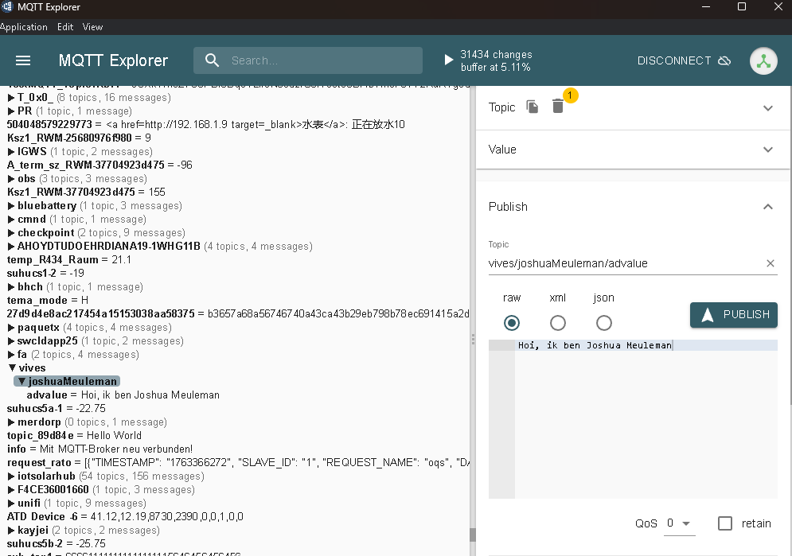

Download het codevoorbeeld WiFi ESP32 C3 template – no credentials en los onderstaande vragen daarmee op. Let op: je zal ook nog extra info of software nodig hebben, zoals hieronder aangegeven.

Het overzicht van alle AT-commando's: https://docs.espressif.com/projects/esp-at/en/release-v3.1.0.0/esp32c3/AT_Command_Set/Basic_AT_Commands.html

De link naar de webserver: https://espeel.devbitapp.be/iot/esp32c3/index.php
Of http://espeel.devbit.lan/iot/esp32c3/index.php indien je geconnecteerd bent met het labnetwerk
De link naar de Firebase RTDB: https://iotdevbru2-default-rtdb.europe-west1.firebasedatabase.app

Postman: https://www.postman.com/downloads
MQTT explorer: http://mqtt-explorer.com

Let op: de invulvragen zijn hoofdlettergevoelig!

vraag 1: Wat is het laatste AT-commando dat verzonden wordt in de functie ConnectToWiFiNetwork()?

antwoord:
AT+CWSTATE?\r\n
vraag 2: Hoeveel tekens/bytes mag het AT-commando MQTTPUBRAW gebruiken om het topic aan te geven?

antwoord:
Maximum 128 bytes

vraag 3 De WiFi-module is via UART1 gekoppeld met het Nucleo-bord. Op welke snelheid wordt er gecommuniceerd?

antwoord: 115200

vraag 4: Gebruik Postman om de bewuste Firebase RTDB uit te lezen. Welke tekst krijg je exact te zien als je testvalue (in plaats van advalue) opvraagt via een GET request?

antwoord:
"IoT Devices rule!"

vraag 5: Met welk WiFi-netwerk probeert de WiFi-module te verbinden?

antwoord:
"devbit"

vraag 6: Maak gebruik van MQTT Explorer en een bereikbare publieke broker zoals test.mosquitto.org of mqtt.devbit.be of ... om een berichtje te verzenden op een zelfgekozen topic. Verwerk ook ergens je naam in het bericht en/of topic.

Plaats een screenshot van dat alles via deze editor.

antwoord:
(Placing screenshots isn't possible from this environment.)

(Locally, do the following and then upload a screenshot here.)
- Broker: `test.mosquitto.org`
- Topic: `vives/<jouwnaam>/advalue`
- Message: `Hoi, ik ben <JouwNaam>`

Upload the screenshot via the editor and replace this paragraph with the image.

vraag 7:Als je met een gewone webbrowser surft naar de bewuste link van de webserver, welke tekst krijg je dan exact te zien?

antwoord:
GET API error.

vraag 8:Bekijk de instellingen van de Independant Watchdog timer (IWDG) in CubeMX. Bereken hoelang het exact duurt vooraleer de microcontroller gereset wordt na het blokkeren van de hoofdlus. Schrijf de volledige berekening uit, enkel het resultaat is niet voldoende.

antwoord:
Gegeven waarden uit het project:
- LSI (LSI_VALUE) = 32 000 Hz (zie `stm32l4xx_hal_conf.h`)
- Prescaler = IWDG_PRESCALER_256 → deling door 256
- Reload = 1249 (waarde in `MX_IWDG_Init`)

Formule (volgens hint: geen +1 gebruiken):
Timeout (s) = Reload * Prescaler / LSI

Invullen:
Timeout = 1249 * 256 / 32000
        = 319744 / 32000
        = 9.992 s

Dus de microcontroller wordt gereset na ongeveer 9.992 seconden (≈ 9.99 s) wanneer de hoofdloop geblokkeerd blijft.

vraag 9:Wordt er DMA gebruikt om de UART-data te ontvangen?

antwoord:
Nee. De code gebruikt `HAL_UART_Receive_IT(&huart1, ...)` (interrupt-driven ontvangst), niet DMA.
 
vraag 10: Er wordt gewerkt met een circulaire buffer in het project. Hoeveel karakters/bytes aan eigen tekst kan je effectief in deze buffer opslaan?

antwoord:
De buffergrootte is `CIRCULAR_BUFFER_SIZE = 2001`, maar er blijft altijd één plaats vrij. Effectief bruikbaar: 2000 bytes/tekens.
