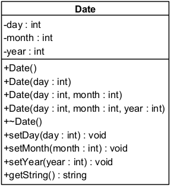

# Date with input validation

## Objective

Design and implement a class named `Date` that handles calendar dates with basic validation logic. You will practice class design, constructors (including overloading and delegation), encapsulation, exception handling, and namespaces.

## Instructions

### 1. Project Structure

Create a C++ project with the following three files:

```text
main.cpp
Date.h
Date.cpp
```

### 2. `main.cpp` — Starter Code

Use the following content in `main.cpp`:

```cpp
#include "Date.h"
#include <iostream>
#include <string>

using namespace std;
using namespace DateLib;

int main(int argc, char const *argv[])
{
    try
    {
        Date date1;
        cout << date1.getString() << endl;

        Date date2(16, 10, 2024);
        date2.setDay(0); // should throw an exception
        cout << date2.getString() << endl;
    }
    catch (const invalid_argument &e)
    {
        cerr << e.what() << endl;
    }

    return 0;
}
```

### 3. `Date.h` — Class Declaration

Your Date class should be declared inside a namespace called `DateLib`. 



Use include guards or `#pragma once` to avoid multiple inclusions.

### 4. `Date.cpp` — Class Implementation

Implement the following:
* Constructor delegation: All constructors should eventually call the full constructor with day, month, and year.
* `setDay()` should throw an `invalid_argument` if the day is not in range (for now, assume max 31 days; detailed validation is optional).
* `setMonth()` should validate the month range (1–12).
* `setYear()` should reject year 0.
* Print `"Date constructor"` when any constructor is called.
* Print `"Date destructor"` when the destructor is called.
* `getString()` should return a date string in the format "DD/MM/YYYY" with leading zeros if needed.

Use `std::stringstream`, `std::setw`, and `std::setfill` for formatting.

## Example Output

When run, your program should output:

```text
Date constructor
01/01/2024
Date constructor
Invalid day
Date destructor
Date destructor
```

## Bonus (optional)

Improve `setDay()` validation logic to account for:

* Months with 30 days (April, June, September, November)
* February with 28 days, or 29 if it's a leap year


