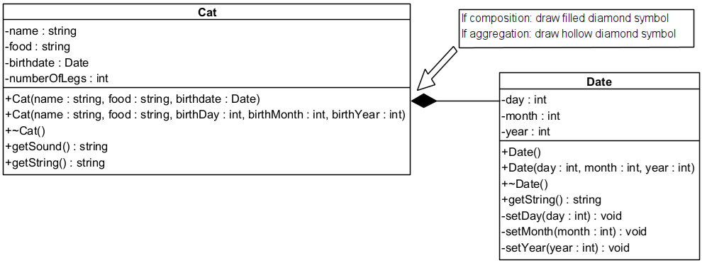

# Cat miauws

Start of with making a copy of your sollution of challenge [Date with input validation](/26-constructors/ch_date-with-input-validation/README.md)

## Instructions

### Step 1: Project Structure

Your project now consists of the following files:

```text
main.cpp
Date.h
Date.cpp
Cat.h
Cat.cpp
```

### Step 2: `main.cpp` — Updated Code

Replace the `main.cpp` with the following:

```cpp
#include "Date.h"
#include "Cat.h"
#include <iostream>
#include <string>

using namespace std;
using namespace DateLib;
using namespace AnimalTree;

int main(int argc, char const *argv[])
{
    try
    {
        Date date1;
        cout << date1.getString() << endl;

        Date date2(16, 10, 2024);
        cout << date2.getString() << endl;

        Cat cat1(date2, "fish", "Mousti");                   // aggregation
        Cat cat2(16, 10, 2024, "fish", "Garfield");          // composition

        cout << cat1.getSound() << endl;
        cout << cat2.getSound() << endl;

        cout << cat1.getString() << endl;
        cout << cat2.getString() << endl;
    }
    catch (const invalid_argument &e)
    {
        cerr << e.what() << '\n';
    }

    return 0;
}
```

### Step 3: `Cat.h` — Class Declaration

Declare a new class `Cat` in a namespace AnimalTree.



### Step 4: `Cat.cpp` — Class Implementation

Implement the methods defined above. Important notes:

* Aggregation: reuse the `Date` object passed as parameter
* Composition: construct a new `Date` inside the constructor
* `getSound()` should return `"Sound: Miauw!!!"`
* `getString()` should return:

```text
Name: [name], birthdate: [DD/MM/YYYY], number of legs: 4, food: [food]
```

## Bonus (optional)

* Add a `speak()` method that combines the name and sound.
* Add validation for name and food (e.g., name must not be empty).
* Try storing an array or vector of `Cat` objects.