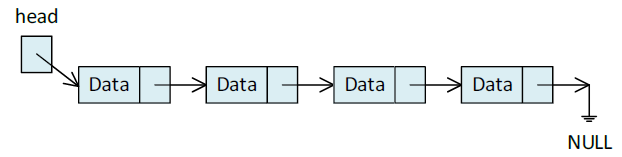
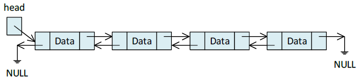
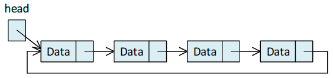
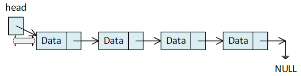
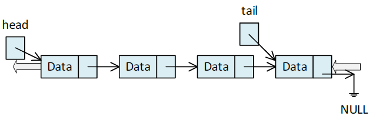
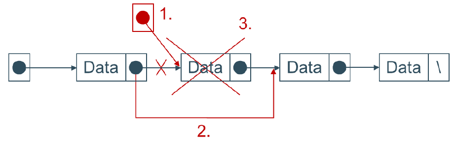
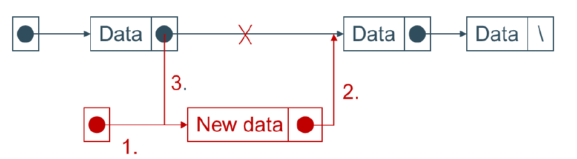

# Dynamic Data Structures

## Introduction

Dynamic memory and pointers in C++ can be used to create flexible data structures such as **linked lists** and **trees**. These structures can grow or shrink during the execution of the program.

### Types of Linked Lists

A linked list is made of nodes dynamically created at runtime. A pointer named `head` refers to the first (or "zero-th") node in the list. The node is a basic unit containing data and a pointer to the next node.

Linked lists can take different forms:

- **Singly Linked List**: Each node points to the next node only.


- **Doubly Linked List**: Each node points to both the next and previous nodes.


- **Circular Linked List**: The last node points back to the head, forming a circle.


In addition to linked lists, there are simplified data structures based on them:

- **Stack**:  
  A LIFO (Last In, First Out) structure.  
  - The head points to the last added node.  
  - Add node → `push`, remove node → `pop`.


- **Queue**:  
  A FIFO (First In, First Out) structure.  
  - Uses both head and tail pointers.  
  - Add node → `enqueue`, remove node → `dequeue`.


We will currently focus on **singly linked lists**.

## Minimal Requirements to Create a Linked List

A list consists of multiple nodes. A node is nothing more than a struct (you can also use a class, this is something for the next exercise) that is stored in the heap. The intention is that a node is created at runtime and multiple nodes are linked to each other.

### Example Node Definition

```cpp
struct node {
    char data;
    struct node* nextNode;
};
```

### Creating Nodes on the Heap

**Option 1**: Using C-style memory management

```cpp
struct node* node1 = (struct node*)malloc(sizeof(struct node));
// Don't forget to free memory!
free(node1);
```

**Option 2**: Using C++ new and delete (preferred)

### Sample Code: Creating and Printing a Linked List

In this example, we link 3 nodes together and print their contents.

```cpp
#include <iostream>
using namespace std;

struct node {
    char data;
    struct node* nextNode;
};

int main() {
    struct node* headPtr = nullptr;

    // node1
    struct node* node1 = new node;
    node1->data = 'A';
    node1->nextNode = nullptr;
    headPtr = node1;

    // append node2 to node1
    struct node* node2 = new node;
    node2->data = 'B';
    node2->nextNode = nullptr;
    node1->nextNode = node2;

    // append node3 to node2
    struct node* node3 = new node;
    node3->data = 'C';
    node3->nextNode = nullptr;
    node2->nextNode = node3;

    // print the nodes
    cout << "headPtr --> ";
    struct node* tempPtr = headPtr;
    while (tempPtr != nullptr) {
        cout << tempPtr->data << " --> ";
        tempPtr = tempPtr->nextNode;
    }
    cout << "NULL" << endl;

    // clean up memory
    delete node3;
    delete node2;
    delete node1;

    return 0;
}
```

Sample Output

```text
headPtr --> A --> B --> C --> NULL
```

## Todo

### 1. Refactor the code

Split the repetitive parts of the code into reusable functions:

* `appendNode`
* `printNodes`

Pass `headPtr` to both functions.

⚠️ You will notice that `headPtr` must be passed **by reference** to `appendNode`, but **by value** to `printNodes`. Why?

### 2. Add More Nodes

Add additional nodes with values like 'D', 'E', 'F', and even duplicate values like 'B'.

### 3. Implement `removeNode(char value)`

Write a function that removes all nodes with the specified character value.

Steps:


1. Use a temporary pointer to access the node to be deleted (avoid memory leaks!).
2. Link the previous node to the next node.
3. Delete the current node and return or print the deleted data.

You can use the same loop structure as in `printNodes` to iterate through the list.

### 4. Implement `insertNode(char value, int index)`

Insert a new node at a specific index (0-based).

Steps:


1. Create a new node on the heap.
2. Link it correctly with its neighbors (first link it to the "next" node).
3. Update the previous node's pointer to point to the new node.

## Notes

* Use functions for clarity and reusability.
* Always release memory using `delete` to prevent memory leaks.