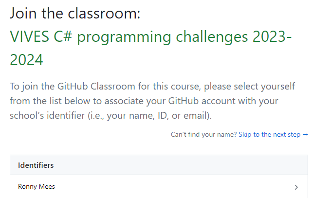

# C++ Practical

This repository contains the challenges that accompany the C++ course at VIVES University of Applied Sciences at Bruges which can be found at [https://programming-in-cpp.netlify.app/](https://programming-in-cpp.netlify.app/).

Each chapter contains a number of challenges. 

All challenges contain at least a `README.md` describing the task at hand. Some contain a c++ program to start from.

## Starting as a Student

To get started you will first need to get a copy of this repository. Follow the steps below to get your own personal copy. This only needs to be done once.

1. Get the GitHub classroom invitation link from Toledo.
2. The first time you will need to allow GitHub Classroom access to your GitHub account. Click the `Authorize github` button.


3. Make sure to select your name from the roster. If your name is not present yet then you can click the `Skip to the next step` for now. But please inform your teacher in that case.



4. Now you can accept the assignment and wait for your own personal copy to be created (can take up to several minutes - please be patient)
5. Open the GitHub page of your repository
6. Copy the ssh clone-url (green button) that looks like `git@github.com:vives-intro-to-programming-2025-2026/assignments-<username>.git`
7. Traverse to a local directory on your system where you wish to clone the repo using Windows Explorer. Open PowerShell in that location by holding down <kbd>Shift</kbd> and right clicking the directory. Next select `Open PowerShell window here` from the context menu.

    *Please don't choose a destination directory that is nested very deeply. The structure of this repo introduces quite a lot of subdirectories and might give problems towards maximum path length in Windows.*

    

8. Issue the `git clone` command followed by the url you copied (right click or <kbd>Ctrl</kbd> + <kbd>V</kbd> to paste).

```bash
git clone <place-ssh-url-here>
```

You should get a similar output:

```text
Cloning into 'assignments-RonnyMees'...
Warning: Permanently added the RSA host key for IP address '140.82.121.4' to the list of known hosts.
remote: Enumerating objects: 1241, done.
remote: Counting objects: 100% (1241/1241), done.
remote: Compressing objects: 100% (625/625), done.
remote: Total 1241 (delta 546), reused 1241 (delta 546), pack-reused 0
Receiving objects: 100% (1241/1241), 602.71 KiB | 1.77 MiB/s, done.
Resolving deltas: 100% (546/546), done.
```

Now you should have your local copy of the repository.

All git commands in other sections should always be executed inside of the project dir called `assignments-<username>`.

## Committing Changes

Changes can be committed and pushed back to GitHub using the terminal.

Traverse to your local `assignments-<username>` directory and open a PowerShell window by holding down <kbd>Shift</kbd> and right clicking the directory. Next select `Open PowerShell window here` from the context menu, as done previously in [section Starting as a Student](#starting-as-a-student).

1. Add all changed files using the command: `git add .`
2. Commit the files and add a message: `git commit -m "My message goes here"`
3. Push your changes to GitHub: `git push origin master`

    

4. To make sure all is well, you can always issue the command `git status`, even in between other commands.

You can also navigate to your GitHub page of this repo and check if all went well.

Make it a habit of committing and pushing regularly. **At least after solving each assignment.**

Also checkout the [shortened version of these steps for everyday use](./short_instructions.md).

## Pulling the Latest Updates

To pull the latest updates you will first need to add the original repo on which this one was based. This only needs to be done once for every cloned instance:

```bash
git remote add base git@github.com:vives-intro-to-programming-2025-2026/assignments.git
```

`base` is the name of remote repo. Now you should see two remotes when issuing the command `git remote -v`. For example:

```text
base     git@github.com:vives-intro-to-programming-2025-2026/assignments.git (fetch)
base     git@github.com:vives-intro-to-programming-2025-2026/assignments.git (push)
origin  git@github.com:vives-intro-to-programming-2025-2026/assignments-RonnyMees.git (fetch)
origin  git@github.com:vives-intro-to-programming-2025-2026/assignments-RonnyMees.git (push)
```

Now every time you wish to pull updates you need to follow these steps:

1. First make sure that you have no local changes. This can be seen by executing `git status`. It should state `nothing to commit, working tree clean`. If not, you first need to add and commit the changes (see section [Committing Changes](#committing-changes)).
2. Now issue the command `git pull base master --allow-unrelated-histories` to pull the latest changes.


Make sure you have no conflicts before committing everything.

Also checkout the [shortened version of these steps for everyday use](./short_instructions.md).

## Overview progress

Please indicate which challenges you have finished by placing a ✔️ emoji in the finished column of the `PROGRESS.md` file. These were found at [https://emojipedia.org](https://emojipedia.org).

## xUnit Tests

Unit Tests allow code to be tested automatically for correctness.

Some challenges might be accompanied by these tests (👍 in `Unit Tests?` column).

Open the `Test Explorer` overview in Visual Studio by navigating to `Test => Windows => Test Explorer`.

Hit the first green arrow at the top left (Run All):


Normally the tests will always fail in the beginning.


If the challenge is solved correctly, all tests should pass.


### xUnit Framework not Found

If you get an error stating the the xUnit Framework cannot be found, you should check the NuGet package manager sources.

Traverse to `Tools => NuGet Package Manager => Package Manager Settings`. Next select the `Package Sources` entry as option (left side). It should contain the `nuget.org` package source as shown in the next screenshot:


If it does not exists, add it with the following settings:

* **Name:** `nuget.org`
* **Source:** `https://api.nuget.org/v3/index.json`

You may need to restart Visual Studio.

